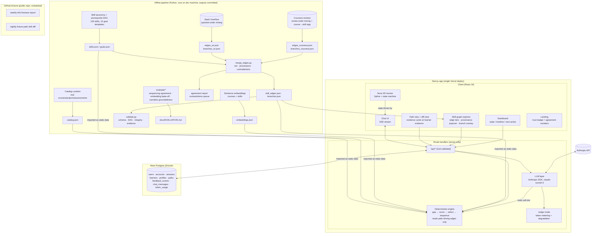

# Pathwise — Architecture

**AI-Powered Personalized Learning Path Recommender** — HCLTech AMPLIfied, Final Round.

> Working names: app **Pathwise**, 3D mentor **Nova**. Both are placeholders; rename is a
> find-and-replace plus one Spline text node.
>
> **Status of this document (2026-08-18):** single source of truth for the final system.
> M0–M5 are built and deployed (https://pathwise-psi-blond.vercel.app). §15–§18 describe
> the approved post-M5 upgrade (evidence layer, self-evaluation, freshness, delivery
> workflow); §19 describes sign-in with Google (added 2026-08-22, D-26); §13 carries the
> ordered milestone sequence, the freeze as an event, and the cut order. **This document carries no time estimates and no dates for future work (D-24): blocks
> are defined by scope and exit criteria; the owner tracks the calendar.**
> Everything a contributor needs is in this file; the earlier companion documents
> (mining technical account, merged-architecture proposal, dynamic-catalog feasibility
> study, four-way evaluation) were consolidated here on 2026-08-18.

Pathwise is a glass-box learning-path recommender: a deterministic knowledge-graph +
embedding engine computes *what* to learn and *in what order*, and a Claude-powered
conversational mentor is the interface that elicits goals, narrates every recommendation
from the engine's own evidence, and adapts the plan as the learner gives feedback. A 3D
robot mentor embodies the assistant across the whole app.

**Design thesis (one line):** the LLM is the interface and the narrator; the engine is the
decision-maker. Every recommendation is traceable to arithmetic the judges can inspect.

**Evidence thesis (added post-M5):** the hand-built skill map is *checked against real
learners* — millions of Stack Overflow question sequences and a million Coursera review
sequences — and every prerequisite arrow carries its provenance and its count. Evidence
augments the map; it never silently rewrites it. Humans decide, machines propose.

---

## 1. System diagram



Key properties: the arrows from LLM to the outside world all pass through the engine or the
judge-mode gate. The engine never calls the LLM; the LLM may only call the engine (as
tools). Static data (catalog, skills, embeddings, **tiered skill edges, branches**) is
bundled with the deploy — no runtime dependency on the offline pipeline, no runtime
mining, no runtime tagging. **The engine reads only path-driving edges** (authored ∪
human-promoted); mined-only edges that have not been promoted are display and evidence,
not control (§15.6).

---

## 2. Tech stack

| Layer | Choice | Version policy |
|---|---|---|
| Framework | Next.js, App Router, route handlers | 16.x stable (pinned at scaffold); fall back to 15.x LTS on any instability |
| Language | TypeScript, `strict: true` | 5.x |
| UI | React 19 · Tailwind CSS 4 · shadcn/ui | latest stable, pinned in lockfile |
| Motion | `motion` (Framer Motion successor) | 12.x+ |
| 3D | `@splinetool/react-spline` + `@splinetool/runtime` | 4.x |
| Graph viz | `@xyflow/react` (React Flow) + dagre | 12.x |
| Charts | Recharts | 3.x |
| DB | Neon Postgres (free tier, pooled connection string) + Drizzle ORM + drizzle-kit migrations | latest |
| Auth | Auth.js v5 (`next-auth@5`) · Google provider · Drizzle adapter · database sessions (§19) | 5.x beta, pinned in lockfile |
| Validation | Zod — single source of truth for API, engine, and LLM structured-output schemas | 4.x |
| LLM | `@anthropic-ai/sdk`, model `claude-sonnet-5` | latest SDK |
| Testing | Vitest (engine unit tests + fixture learners + data validation smoke test) | latest |
| Offline pipeline | Python 3.12 (uv), `sentence-transformers` (MiniLM baseline; candidate models per §16.2) on MPS, pandas | dev-machine only |
| Evidence mining | Google BigQuery public Stack Overflow mirror (free-tier query, sandbox account) with Stack Exchange Data Explorer as human-run fallback; Kaggle Coursera reviews CSVs (gitignored) | offline only |
| Freshness / CI | GitHub Actions (public repo: weekly link-liveness, nightly fixture-drift diff, manual `workflow_dispatch`) | free for public repos |
| Deploy | Vercel Hobby (app + env vars) · Neon (DB) | free tiers only |
| Source control | Private GitHub repo during build; feature branches + PR review + CODEOWNERS (§18); visibility flipped for the evaluation team at submission | — |

Notes:
- **No Vercel AI SDK.** Anthropic SDK directly, because we use `messages.parse()`
  (Zod-validated structured outputs), explicit `cache_control` prompt caching, and tool
  use. Streaming to the client is a small SSE helper (~100 lines).
- **No runtime Python, no runtime embedding API, no runtime mining.** All vectors and all
  evidence precomputed and committed (see §4.3, §10, §15).
- Node runtime (not edge) for all LLM routes — streaming + Postgres + SDK compatibility.

---

## 3. Repository layout (the public repo)

```
pathwise/
├── ARCHITECTURE.md              # this document
├── README.md                    # setup, env vars, seed, deploy, pipeline + evidence commands, data sources + attribution
├── CODEOWNERS                   # required reviewer on everything (§18)
├── .github/workflows/           # link-check.yml (weekly), drift-check.yml (nightly), both workflow_dispatch
├── app/
│   ├── page.tsx                 # landing: hero, "how it works" strip, trust badge, feature wall, keep-fresh section
│   ├── learn/[learnerId]/       # main app shell: chat + Nova / Path / Skill Graph / Dashboard
│   └── api/                     # route handlers (see §6)
├── src/
│   ├── engine/                  # PURE functions, zero I/O, fully unit-tested
│   │   ├── gap.ts               # skill-gap analysis + prereq closure (reads path-driving edges)
│   │   ├── score.ts             # hybrid candidate scoring
│   │   ├── select.ts            # greedy weighted set-cover
│   │   ├── sequence.ts          # toposort + milestone phasing
│   │   ├── replan.ts            # feedback rules → profile ops → diff
│   │   ├── evidence.ts          # evidence-object construction (+ learnerEvidence attachment)
│   │   ├── dashboard.ts         # progress, radar, timeline, next action
│   │   ├── profile.ts           # ProfileOp application
│   │   └── similarity.ts        # dot products over precomputed vectors
│   ├── llm/
│   │   ├── client.ts            # Anthropic client, model/effort config
│   │   ├── prompts.ts           # stable system prompts (cache-friendly, frozen)
│   │   ├── extract.ts           # conversation → ProfileOp[] via messages.parse
│   │   ├── mapGoal.ts           # free-text goal → skill IDs (closed vocabulary)
│   │   ├── explain.ts           # evidence object → narration (may cite learnerEvidence numbers only)
│   │   ├── chat.ts / tools.ts   # tool-use loop (tools = engine functions)
│   │   └── judgeMode.ts         # token metering, caps, degradation
│   ├── nova/                    # Nova state machine (pure reducer) + stage contract
│   ├── db/                      # drizzle schema + queries
│   ├── data/                    # catalog.json, skills.json, goals.json, embeddings.json,
│   │                            # skill_edges.json, branches.json   (all pipeline-generated)
│   ├── schemas/                 # Zod: Skill, Course, Profile, Path, Evidence, ProfileOp, ProfileCard,
│   │                            # SkillEdge, Branch, CourseTag, TagSkillMap, Feedback, Nova…
│   └── components/              # nova/, chat/, path/, graph/, dashboard/, landing/, ui/
├── pipeline/                    # Python (uv). Curation + annotation + embeddings + EVIDENCE + evaluation
│   ├── curate.py · annotate.py · embed.py · validate.py
│   ├── mine_so.py               # Stack Overflow question-order mining (BigQuery SQL + SEDE fallback) (§15.2)
│   ├── mine_coursera.py         # Coursera review-order mining at conf ≥ 0.85 (§15.3)
│   ├── tag_courses.py           # Coursera course → skill tags, two-pass, spot-check protocol (§15.3)
│   ├── pool.py                  # course→course edges → skill→skill edges; branch shares (§15.4)
│   ├── merge_edges.py           # authored ∪ mined → tiered skill_edges.json, agreement report, contradictions (§15.5)
│   ├── evaluate/                # sequencing_agreement.py · embedding_bakeoff.py · narration_groundedness.py (§16)
│   ├── refresh.sh               # curate → annotate → embed → mine → tag → pool → merge → validate (§17)
│   ├── sources/                 # hand-maintained inputs: per-domain catalog sources, tag_skill_map.json,
│   │                            # coursera_catalog_map.json, promotions.md, contradictions.md (resolutions)
│   ├── evidence/                # COMMITTED small derived outputs: edges_so.json, edges_coursera.json,
│   │                            # course_skill_tags.json, agreement_report.md/.json, pooled_support_histogram.md
│   └── build/                   # gitignored scratch (raw CSVs, spot-check sheets, proposals.json)
├── tests/                       # engine fixtures: 5 seeded learners with known-good paths; property tests
└── docs/                        # EVALUATION.md, solution doc sources, demo script
```

Module boundary rules (enforced by convention + review):
- `src/engine/**` imports nothing from `llm/`, `db/`, or `app/`. Pure data-in/data-out.
- `src/llm/**` may import `engine/` (to expose tools) but never `db/` directly — persistence
  goes through the route handler.
- `src/data/**` is generated by `pipeline/` and never hand-edited (`validate.py` enforces
  schema + DAG acyclicity + referential integrity + evidence integrity, wired into `npm test`).
- `src/data/skill_edges.json` is the **only** prerequisite source the engine reads, and only
  the edges with `drivesPath === true`. `skills.json.prereqs` remains the authored source of
  those edges (the pipeline copies them into `skill_edges.json` with `origin: "authored"`).
- Raw evidence inputs (Stack Overflow query results, Coursera CSVs) never enter the repo;
  only small derived JSON/MD under `pipeline/evidence/` and `src/data/` do.

---

## 4. Data models

### 4.1 Static data (committed JSON, Zod-validated)

```ts
// skills.json — 159 entries across 10 domains, 193 prereq edges forming a DAG
type Skill = {
  id: string;              // "react"
  name: string;            // "React"
  domain: Domain;          // "foundations" | "web-frontend" | "web-backend" | "data-analysis" | "data-engineering"
                           // | "machine-learning" | "ai-engineering" | "cloud" | "devops" | "security"
  description: string;     // 1–2 sentences, also the embedding source text
  levelBand: 1 | 2 | 3;    // foundational / intermediate / advanced
  prereqs: string[];       // skill ids; validate.py asserts acyclic; copied into skill_edges.json as authored edges
};

// goals.json — 15 role templates
type GoalTemplate = {
  id: string;                                  // "frontend-developer"
  title: string;
  description: string;
  requiredSkills: { skillId: string; level: 1 | 2 | 3 }[];
};

// catalog.json — 246 items today (183 courses, 36 projects, 27 assessments); 300 courses is the M6 target
type CatalogItem = {
  id: string;
  kind: "course" | "project" | "assessment";
  title: string;
  provider: string;        // "Coursera (DeepLearning.AI)" | "freeCodeCamp" | "Kaggle" | docs | ...
  url: string;             // real, clickable — provenance for judges
  description: string;     // embedding source text
  skillsTaught: { skillId: string; level: 1 | 2 | 3 }[];
  skillsRequired: { skillId: string; level: 1 | 2 | 3 }[];
  difficulty: 1 | 2 | 3 | 4 | 5;
  durationHours: number;
  format: "video" | "interactive" | "text" | "project";
  cost: "free" | "freemium" | "paid";
  qualityPrior: number;    // 0–1, from ratings/reputation, documented per source
};

// embeddings.json — { [id: string]: number[] } (384-dim MiniLM today; model may change per §16.2,
// dimension recorded in the file header), ids cover every CatalogItem and every Skill.
```

### 4.2 Learner state (Postgres, Drizzle)

```
users           (id, name, email, emailVerified, image)                  -- Auth.js (D-26, §19)
accounts        (userId FK, type, provider, providerAccountId, tokens…)  -- Auth.js; PK (provider, providerAccountId)
sessions        (sessionToken PK, userId FK, expires)                     -- Auth.js database sessions
verification_tokens (identifier, token, expires)                          -- Auth.js (unused by Google sign-in, kept for the adapter)
learners        (id, user_id FK → users nullable, display_name, avatar_seed, created_at)  -- owned by one user; pre-auth rows orphaned
profiles        (learner_id PK/FK, data JSONB, updated_at)
paths           (id, learner_id FK, version, data JSONB, diff JSONB, created_at)
feedback_events (id, learner_id FK, type, payload JSONB, created_at)   -- append-only
chat_messages   (id, learner_id FK, role, content JSONB, created_at)
token_usage     (id, learner_id FK, user_id FK nullable, day, input_tokens, output_tokens)  -- judge mode, per-user cap key
```

```ts
// profiles.data
type Profile = {
  goals: (
    | { type: "role"; templateId: string }
    | { type: "custom"; text: string; mappedSkills: { skillId: string; level: 1|2|3 }[] }
  )[];
  skills: Record<string, { level: 0 | 1 | 2 | 3; source: "stated" | "inferred" | "assessed" }>;
  preferences: {
    hoursPerWeek: number;                 // default 6
    formats: CatalogItem["format"][];     // empty = no preference
    budget: "free-only" | "any";
    pace: "relaxed" | "standard" | "intense";
    dislikedProviders?: string[];         // memo from not_interested events
    dislikedFormats?: CatalogItem["format"][];
  };
};

// The LLM never writes Profile directly. It emits ProfileOp[], applied deterministically:
type ProfileOp =
  | { op: "add_goal"; goal: Profile["goals"][number] }
  | { op: "remove_goal"; index: number }
  | { op: "set_skill"; skillId: string; level: 0|1|2|3; source: "stated" | "inferred" | "assessed" }
  | { op: "set_preference"; key: keyof Profile["preferences"]; value: unknown };

// paths.data
type Path = {
  phases: {
    title: string;                        // "Phase 2 — Core React"
    milestone: string;                    // "Build and deploy a component-driven UI"
    items: {
      catalogId: string;
      status: "todo" | "in_progress" | "done" | "skipped";
      evidence: Evidence;                 // §7 — attached at generation time
    }[];
  }[];
  meta: { generatedAt: string; engineVersion: string; trigger: "initial" | "replan"; };
};

// paths.diff — computed vs previous version, drives the "path updated" UI
type PathDiff = {
  added:   { catalogId: string; reason: string }[];
  removed: { catalogId: string; reason: string }[];
  reordered: boolean;
  cause: { eventId: string; humanReadable: string };  // "You marked X as too hard"
};
```

### 4.3 Evidence data (static, committed, Zod-validated) — added post-M5

```ts
// src/data/skill_edges.json — the merged, tiered edge set. skills.json.prereqs stays the authored source.
type EvidenceSource = "stackoverflow" | "coursera";

type SourceStat = {
  support: number;         // count of sequences with from → to
  reverse: number;         // count with to → from
  confidence: number;      // support / (support + reverse)
  n: number;               // support + reverse
  detail?: {               // source-specific
    nCoursePairs?: number;                                                    // coursera: distinct course pairs pooled
    coursePairs?: { fromCourseId: string; toCourseId: string; support: number }[];  // coursera: top 5
    tagsFrom?: string[]; tagsTo?: string[];                                   // stackoverflow: tags behind each skill
    cohortRule?: string;                                                      // stackoverflow: the age filter applied (§15.2)
  };
  caveat: string;          // fixed per source, rendered wherever the numbers are:
                           // stackoverflow: "Stack Overflow question order (first question per tag), users who
                           //   started after both technologies existed; asking ≠ completing"
                           // coursera: "Coursera learners 2015–2020; sequences reconstructed from review order;
                           //   pseudo-users by reviewer name"
};

type SkillEdge = {
  from: string;            // prerequisite skill id
  to: string;              // dependent skill id
  origin: "authored" | "mined";
  // For origin "authored" (all 193 hand-built edges), the evidence status is one of:
  //   "confirmed-both"          — both sources confirm the direction (each conf ≥ 0.70, n ≥ floor)
  //   "confirmed-one-source"    — exactly one source confirms; the other is unobserved or below floor
  //   "contradicted-in-review"  — a source shows the OPPOSITE direction at conf ≥ 0.85, n ≥ 50 → human queue;
  //                               the authored edge keeps driving paths until a human resolves it (N-1)
  //   "no-data"                 — no source observed the pair above the support floor
  // For origin "mined" (an edge only the data suggests, no authored counterpart):
  //   "candidate"               — display + evidence only, drivesPath false
  //   "promoted"                — a human promoted it (§15.6 policy); drivesPath true
  status: "confirmed-both" | "confirmed-one-source" | "contradicted-in-review" | "no-data" | "candidate" | "promoted";
  drivesPath: boolean;     // authored → true; mined → true only when status === "promoted"
  sources: Partial<Record<EvidenceSource, SourceStat>>;
  resolution?: { by: "human"; decision: "keep-authored" | "flip" | "remove" | "both-valid-drop-edge" | "promote"; note: string; date: string };
};

// src/data/branches.json — "what did learners do next", per source, transition shares ONLY (never satisfaction)
type Branch = {
  from: string;                                  // skill id
  source: EvidenceSource;
  next: {
    to: string;
    n: number;                                   // learners who went from → to next (immediate successor)
    shareRaw: number;                            // n / nTotal
    shareShrunk: number;                         // (n + α·prior) / (nTotal + α), uniform prior over observed next-skills, α = 20
    inCatalog: boolean;                          // ≥ 1 catalog item teaches `to` (true for all 159 skills today)
  }[];
  nTotal: number;
  minSupportMet: boolean;                        // nTotal ≥ 50 and only branches with n ≥ 5 listed
  caveat: string;                                // same fixed string as SourceStat.caveat
};

// pipeline/sources/tag_skill_map.json — hand-built, both humans check every row (no LLM)
type TagSkillMap = { tag: string; skillId: string; note?: string }[];   // e.g. {"tag":"reactjs","skillId":"react"}, {"tag":"react-hooks","skillId":"react"}

// pipeline/evidence/course_skill_tags.json — the Coursera single point of failure, made inspectable
type CourseTag = {
  courseId: string;              // Coursera course_id from Coursera_courses.csv
  name: string;
  skillsTaught: { skillId: string; level: 1|2|3 }[];
  confidence: "high" | "medium" | "low";     // from the two-pass agreement (§15.3)
  spotChecked: boolean;
  checkedBy?: string;
  catalogItemId?: string;        // when this course is (part of) an item in catalog.json
};
```

Every rendered number from these files carries its `caveat`. Nothing rating-derived is
present anywhere (no "satisfied", no "found it hard").

---

## 5. The recommendation engine

Pure TypeScript, four stages, every stage returns its working alongside its answer. Weights
live in one exported constant (`ENGINE_WEIGHTS`) and are documented in the solution PDF.

### 5.1 Skill-gap analysis (`gap.ts`)

```
input:  Profile, GoalTemplate | mappedSkills, path-driving edges (skill_edges.json where drivesPath)
output: Gap = { skillId, targetLevel, currentLevel,
                reason: "goal" | "prereq-of:<skillId>",
                graphPath: string[] }[]        // path from nearest known skill
```

1. `required = union(goal.requiredSkills)`, level-aware.
2. `direct = required where profile.level < targetLevel`.
3. Expand transitive prerequisites through the DAG (BFS over path-driving edges), adding any
   prerequisite below its needed level, tagged `prereq-of`.
4. `graphPath` records the chain (e.g. `["javascript", "react"]`) — consumed verbatim by
   the explainability UI (§7).

Because path-driving = authored ∪ human-promoted, behaviour is byte-identical to reading
`skills.json.prereqs` until a human promotes a mined edge; the fixture snapshots (§5.6) are
the oracle for that invariant.

### 5.2 Candidate scoring (`score.ts`)

For every CatalogItem with ≥1 taught skill in the gap:

```
score = w_cov  · gapCoverage        // Σ levels of gap skills taught / Σ gap levels, ∈[0,1]
      + w_lvl  · levelFit           // 1 − penalty(item difficulty vs learner level at that point)
      + w_pref · preferenceFit      // format ∈ prefs, cost ≤ budget, duration vs hours/week, disliked provider/format penalty
      + w_qual · qualityPrior
      + w_sim  · cosine(itemVec, goalCentroid)   // goalCentroid = mean of gap-skill vectors
```

Defaults: `w = {cov: .40, lvl: .15, pref: .15, qual: .10, sim: .20}`. All five components
are logged per candidate into the Evidence object. Items whose `skillsRequired` cannot be
satisfied by the profile plus earlier-planned items get a hard sequencing constraint, not a
score penalty. **No evidence term in the score** (D-14): learner evidence explains, it does
not rank.

### 5.3 Selection — greedy weighted set-cover (`select.ts`)

Classic greedy: repeatedly pick the item maximizing `(uncovered gap levels it teaches) ×
score / durationHours` until the gap is covered or the learner's time budget
(`hoursPerWeek × horizonWeeks`, horizon derived from pace) is exhausted. Guarantees a
small, non-redundant course set; the greedy ratio bound gets one honest sentence in the
docs. Projects are selected after courses: one project per phase whose
`skillsRequired ⊆ skills taught by that phase`. Assessments attach at phase boundaries.

### 5.4 Sequencing (`sequence.ts`)

Topological sort of selected items over the path-driving skill DAG (item A precedes B if A
teaches a skill B requires), ties broken by difficulty ascending, then duration ascending;
cycles among soft edges are broken at soft edges first so hard requirements hold. Phases
are cut at graph "levels" (antichains of the induced partial order), each phase named after
its dominant domain and given a milestone string from a small template table. Output is
`Path`. Branch shares are **not** used as a tie-breaker (ruled out, §15.9).

### 5.5 Adaptation (`replan.ts`)

Deterministic rules over `feedback_events`; each rule = event → `ProfileOp[]` + whether to
trigger regeneration:

| Event | Effect | Replan? |
|---|---|---|
| `completed(item)` | taught skills → `level = taught level, source: inferred`; item `done` | only if it unlocks a shortcut |
| `too_hard(item)` | for each `skillsRequired`: decrement inferred level by 1 (floor 0) | yes — gap reopens, remediation inserted |
| `too_easy(item)` | taught skills: +1 inferred (cap 3); item `skipped` | yes — dedupe now-covered items |
| `not_interested(item)` | preference penalty (provider/format memo in profile), item excluded | yes |
| `quiz_result(skill, score)` | `level = f(score), source: assessed` (assessed outranks inferred) | yes if gap changed |

Regeneration reruns §5.1–5.4 against the mutated profile (carrying over completed progress),
then computes `PathDiff` with a human-readable `cause`. The diff — not just the new path —
is a first-class UI object.

### 5.6 Testing

Vitest fixtures: 5 seeded learners (beginner-frontend, career-switcher-to-DS,
partial-skills-ML, time-poor-cloud, custom-goal) with snapshot-tested paths; property
tests: paths are always topologically valid, never contain an item whose requirements
aren't met by prior items, always cover the gap or exhaust budget; DAG acyclicity (over
path-driving edges); diff symmetry; **no `learnerEvidence` without a matching edge in
`skill_edges.json`; branch shares sum to 1 ± 1e-6; no branch listed with n < 5**. These
tests are the safety net that makes fast iteration possible everywhere else, and they are
the oracle every evidence-layer change must leave green (N-4).

---

## 6. API surface

All handlers Zod-validate input and output. `learnerId` stays an unguessable UUID in URLs,
but since D-26 authorisation is ownership: **session** = a signed-in Google user is required
(else 401); **owner** = the learner must belong to that user (else 404, never 403) — §19.

| Route | Method | Auth | Purpose |
|---|---|---|---|
| `/api/auth/*` | GET/POST | — | Auth.js: Google sign-in, callback, session, sign-out |
| `/api/learners` | POST | session | create learner (name) owned by the caller → id; GET: the caller's learners for the picker |
| `/api/learners/[id]/profile` | GET/POST | owner | read / apply `ProfileOp[]` (used by the intake card, D-13) |
| `/api/chat` | POST | owner | SSE stream. Body: `{learnerId, message}`. Runs the tool-use loop (§8.3); side effects: chat persisted, ProfileOps applied, path regenerated when tools request it. Stream events: `text`, `nova_state`, `path_updated`, `ui_card`, `usage` |
| `/api/path/generate` | POST | owner | `{learnerId}` → run engine, persist new version, return Path |
| `/api/path/[learnerId]` | GET | owner | latest Path + latest PathDiff |
| `/api/feedback` | POST | owner | `{learnerId, event}` → apply §5.5 rules; returns `{path?, diff?}` |
| `/api/explain` | POST | owner | `{learnerId, catalogId}` → `{evidence, narration}` (narration LLM-generated, evidence pure) |
| `/api/dashboard/[learnerId]` | GET | owner | radar data, progress %, streak, next-best-action (all computed server-side from profile + path + events) |
| `/api/catalog/search` | GET | — | `?skill=&domain=&q=` — powers the graph explorer side panel |

Evidence data (`skill_edges.json`, `branches.json`) is static and imported by the client
graph explorer directly — no route needed. Internal (not routes): `extract.ts`, `mapGoal.ts`
are called inside `/api/chat`'s loop.

---

## 7. Explainability design

Every path item carries an `Evidence` object built by `evidence.ts` at generation time:

```ts
type Evidence = {
  catalogId: string;
  gapSkillsCovered: { skillId: string; reason: Gap["reason"]; graphPath: string[] }[];
  scoreBreakdown: { coverage: number; levelFit: number; preferenceFit: number;
                    quality: number; similarity: number; total: number };
  sequencedAfter: { catalogId: string; becauseSkill: string }[];
  provenance: string;    // the real course URL
  learnerEvidence?: {    // post-M5: attached when a covered gap skill sits on an edge with mined data
    edges: { from: string; to: string; source: EvidenceSource; support: number; reverse: number; confidence: number; caveat: string }[];
    branch?: { from: string; toThis: number; nTotal: number; shareShrunk: number; source: EvidenceSource; caveat: string };
  };
};
```

Three renderings, always shown together:

1. **Structural (cannot hallucinate):** skill chips on the course card; clicking a card
   highlights `graphPath` in the React Flow skill graph — "you know *JavaScript* → this
   unlocks *React* → required for *Frontend Developer*". Score breakdown as a small bar
   set. Pure client rendering of Evidence, no LLM anywhere.
2. **Narrative (grounded):** `/api/explain` prompts claude-sonnet-5 with *only* the
   Evidence object + profile summary, system prompt: explain using only the provided
   facts; do not introduce claims not present in the evidence; numbers (n, %) may be
   cited only from `learnerEvidence`. Low effort, ~150 token output, delivered in Nova's
   voice. Its groundedness is **measured**, not asserted (§16.3).
3. **Provenance (post-M5):** when `learnerEvidence` exists, the card shows one extra line —
   *"Confirmed by 1,617 learner sequences (94 % took these in this order)"* — with a hover
   listing the sources, their counts and their caveats. In the graph explorer every edge is
   styled by tier and its popover shows the same numbers (§9.3).

Because all three render side by side, any narrative drift is immediately visible against
the structural ground truth — this is the line the solution doc leads with for criterion
"AI/ML Implementation": *explanations are generated from the same data structure the
ranking arithmetic produced, and the prerequisite graph they cite is checked against real
learners.*

---

## 8. LLM integration

### 8.1 Model & parameters

- Model: **`claude-sonnet-5`** everywhere. (Intro API pricing $2/$10 per MTok runs through
  2026-08-31 — the entire build + judging window.)
- Adaptive thinking (default). `output_config.effort`: `"low"` for chat turns, extraction,
  narration, tagging; `"medium"` for full path-context reasoning turns.
- Streaming for all user-facing generation; `max_tokens` 1024 (chat/narration), 2048
  (goal-mapping with rationale).
- Structured outputs via `client.messages.parse()` with Zod schemas (`ProfileOp[]`,
  `MappedGoal`, `ProfileCard`, and offline `CourseTag`) — no JSON-parsing retry loops.

### 8.2 Prompt caching

`prompts.ts` exports frozen system prompts (no timestamps, no interpolated user data —
dynamic context goes into the message turns). The chat system prompt (persona + tool
guidance + skill-taxonomy digest, ~2–3k tokens > 1024-token Sonnet 5 cache minimum)
carries `cache_control: {type: "ephemeral"}`. Verified in dev via
`usage.cache_read_input_tokens`. The one-line addition allowing narration to cite
`learnerEvidence` numbers invalidates the explain prompt's cache once; cache reads must be
re-verified after that commit.

### 8.3 Chat tool-use loop

The assistant's tools are the engine, exposed read/write-through-ops only:

| Tool | Maps to |
|---|---|
| `get_profile` | DB read |
| `apply_profile_ops` | validated `ProfileOp[]` → §4.2 application |
| `map_custom_goal` | `mapGoal.ts` (closed skill vocabulary) |
| `generate_path` / `replan_path` | §5 engine |
| `explain_item` | Evidence lookup (§7) |
| `search_catalog` | filtered catalog query |
| `get_dashboard_summary` | same computation as `/api/dashboard` |
| `propose_profile_card` | builds a structured intake card (D-13): the goal's required skills + prerequisite closure, each with a level chooser, plus hours/pace/budget/formats; emitted as a `ui_card` SSE event and stored on the assistant message |

Loop: manual tool-use loop inside the SSE handler (stream text deltas out as they arrive;
execute tools server-side; cap 6 tool iterations/turn). `nova_state` SSE events are emitted
at loop transitions (`listening → thinking → speaking → celebrating`) to drive the 3D
mentor.

**Structured intake (D-13).** When a goal is recorded and the learner has *stated no
skills*, the assistant calls `propose_profile_card` instead of `generate_path` and stops
the turn. The client renders the card inside the conversation (skill chips with a
none/basics/comfortable/strong level chooser, hours stepper, pace / budget chips,
**Build my path** and **Skip — just build it**). Submitting posts `ProfileOp[]`
(`set_skill … source:"stated"`, `set_preference …`) to `/api/learners/[id]/profile`
and then sends a normal chat turn ("I've filled in what I know — build my path"), so
Nova calls `generate_path` and narrates as usual. The card is a presentation of ops:
the engine, schemas and application rules are unchanged; the card's shape is one Zod
schema in `src/schemas/profileCard.ts` shared by the tool, the SSE event and the UI.
If the learner already stated skills in their message, the loop behaves as before
(act first, ask later).

### 8.4 Judge mode (cost control + resilience)

- Per-learner daily token budget (~150k) and a global daily cap, metered in `token_usage`
  from the `usage` block of every response.
- Over budget → routes return `{degraded: true}`; UI switches Nova to "resting", chat is
  disabled with a friendly notice, and **everything deterministic keeps working** — path
  generation, feedback/replanning, structural + provenance explanations, dashboard, graph
  explorer. Documented as a resilience feature: the product degrades to a working
  recommender, not a blank screen.
- `RateLimitError`/`529` → exponential backoff via SDK defaults, then degrade for that turn.

---

## 9. Frontend & the 3D mentor

### 9.1 App shell

Three-region layout on `/learn/[learnerId]`: persistent Nova presence (hero-size on
landing, docked mini-stage in-app), chat panel, and a main area with tabs **Nova / Path /
Skill Graph / Dashboard**. Dark, high-contrast aesthetic (design tokens signed off in M5);
cursor-reactive hero via `useMotionValue` + springs.

### 9.2 Nova state machine

```
idle → listening (input focus) → thinking (SSE open / tool running)
     → speaking (text streaming) → idle
     celebrating (milestone completion event) → idle
     resting (judge-mode degraded)
```

Implemented as a small reducer fed by `nova_state` SSE events + UI events; each state maps
to a Spline runtime trigger or code-driven pose. **The state machine is identical
regardless of which visual ships**, which is what made the 3D risk cheap:

- Plan A (shipped): Spline robot scene, lazy-loaded, code-driven poses per state.
- Plan B: abstract 3D "orb/core" mentor built from Spline primitives.
- Plan C: static rendered robot + `motion` micro-animations. The Orb (`thinking-orbs`) is
  the single loading/thinking indicator and the fallback stage until the scene loads.

### 9.3 Key screens → judged features

| Screen | Requirement it demonstrates |
|---|---|
| Landing: Nova + "describe your goal" entry; **"how it works" strip (talker / matcher / map); trust badge with the agreement numbers; keep-fresh section** | 1 (conversational interface), 6 (UX), and the pitch itself (§9.4) |
| Chat with profile side-drawer filling live; in-chat intake card | 2 (profiling engine — ops applied visibly) |
| Path view: phases, milestones, evidence cards **with the provenance line** | 3, 4 (recommendations + structured roadmap) |
| Skill graph: gap coloring, click-to-highlight paths; **edge styling by tier (solid = confirmed-both, dashed = confirmed-one / no-data authored, dotted = mined candidate, amber = contradicted-in-review), provenance popover per edge, branch overlay on a selected skill when `minSupportMet` ("not enough learner data on this step" otherwise)** | 5 (explainability, structural + provenance) |
| Feedback → animated path diff | adaptation (task statement: "adapt based on feedback") |
| Dashboard: radar, timeline, streak, next action | 6 (dashboard) |

Charting work loads the `dataviz` design guidance at build time; graph and radar get the
polish budget since they appear in the demo video's money shots. Evidence UI reuses the M5
tokens — no new visual language.

### 9.4 The UI story pass (post-architecture, pre-freeze; D-21)

One dedicated block after the last architecture block reworks the landing page and polishes
the app surface so a first-time visitor understands within one screen what was built and
why it is different. Copy is plain language with technical terms attached only where they
earn their place ("checked against 1M+ real learner sequences", not "leveraging empirical
multi-source validation"). Contents: hero copy; a three-sentence "how it works" strip
(**the talker** — Nova asks what you want and explains; **the matcher** — arithmetic picks
courses and their order; **the map** — a hand-built skill map, checked against real
learners); the **trust badge** rendering the agreement report's headline numbers (§15.7);
the keep-fresh section (§17). Exit criterion: a stranger reads the landing page for 30
seconds and can say what it does and why the map can be trusted. Its floor is hero copy +
trust badge: if the owner invokes the cut order, the block reduces to that floor; it is
never fully cut, and its floor never moves.

---

## 10. Offline data pipeline

`pipeline/` (Python, uv, runs on the dev Mac; outputs committed):

1. **`curate.py`** — assemble the raw course list from public catalog pages of Coursera,
   edX, freeCodeCamp, Udemy, YouTube playlists, Kaggle, and official docs/tutorials. Real
   titles, real URLs. `--check-urls` probes every URL (HEAD; YouTube via oembed; hosts that
   block scripted requests are classified "unverifiable", not "dead"). Target ≥300 courses,
   ≥40 projects, ≥25 assessments; **150 courses is the demo-viability floor** (met in M1);
   top-up is an M6 item.
2. **`annotate.py`** — LLM-assisted annotation (skills taught/required with levels,
   difficulty, duration, format, quality prior) against the fixed taxonomy; seeded ~10 %
   per-domain sample written to `pipeline/build/spotcheck.md` for human review.
3. **`embed.py`** — sentence-transformer vectors for all items + skills → `embeddings.json`.
   Model = MiniLM `all-MiniLM-L6-v2` unless the bake-off (§16.2) selects a better one; the
   chosen model id and dimension are written into the file header and the README.
4. **`validate.py`** — Zod-mirror schema check, DAG acyclicity (path-driving edges only),
   referential integrity (every `skillId` exists, every gap skill reachable), embedding
   coverage, **evidence integrity** (every `mined` block carries support/reverse/confidence/n;
   branch shares sum to 1 ± 1e-6; no `learnerEvidence` without a matching edge; no
   satisfaction wording in any caveat), and a warning for any skill nobody teaches. Wired
   into `npm test` via a committed JSON report so CI catches drift.
5. **`mine_so.py`** — Stack Overflow question-order mining → `pipeline/evidence/edges_so.json`,
   `branches_so.json` (§15.2).
6. **`mine_coursera.py`** — Coursera review-order mining at conf ≥ 0.85 →
   `pipeline/evidence/edges_coursera_course.json` with directional counts (§15.3).
7. **`tag_courses.py`** — Coursera course → skill tags, two passes + spot-check gate →
   `pipeline/evidence/course_skill_tags.json` (§15.3).
8. **`pool.py`** — course→course → skill→skill edges + branch shares for Coursera;
   SO edges are already skill-level. Emits the measured pooled-support histogram (§15.4).
9. **`merge_edges.py`** — authored ∪ mined → `src/data/skill_edges.json`, `src/data/branches.json`,
   `pipeline/evidence/agreement_report.md/.json`, `pipeline/sources/contradictions.md` (§15.5–15.7).
10. **`evaluate/`** — the self-evaluation harness → `docs/EVALUATION.md` (§16).
11. **`refresh.sh`** — the one documented entry point that runs 1 → 9 (mining steps skipped
    when their raw inputs are absent, with a printed notice) and prints a summary (§17).

Skill taxonomy + goal templates are hand-built first (they're the spine); catalog
annotation and course tagging reference them. Order of authority for prerequisite
structure: **authored edges drive paths; evidence annotates them; humans resolve
disagreements through `pipeline/sources/` files, never by hand-editing `src/data/`.**

---

## 11. Decision log

| # | Decision | Options considered | Why this one | Cost accepted |
|---|---|---|---|---|
| D-01 | Next.js monolith on Vercel + offline Python pipeline | FastAPI+SPA; Streamlit | UI reference is React; one deploy; all ML shifted to build time so runtime needs no Python | Engine in TS; no arbitrary runtime embedding |
| D-02 | Anthropic SDK direct (no AI-SDK abstraction) | Vercel AI SDK | Need `messages.parse`, explicit caching, tool use | ~100 lines SSE glue |
| D-03 | `claude-sonnet-5`, effort low/medium, prompt caching | Opus 5; Haiku 4.5 | Intro pricing through the deadline; quality/cost sweet spot for $5–15 budget | Marginally below Opus on hardest reasoning |
| D-04 | Glass-box engine: skill DAG + set-cover + toposort + precomputed embeddings; LLM never ranks | Pure-LLM planner; runtime RAG; collaborative filtering | Deterministic, testable, explainable; strongest honest AI/ML story; CF impossible without real interaction data | Taxonomy/catalog curation effort |
| D-05 | Closed skill vocabulary → no runtime embedding API | Voyage/Gemini embeddings at runtime | Zero extra dependency/cost; goal mapping via LLM into skill space is more explainable | Exotic goals snap to nearest taxonomy skills |
| D-06 | Explanations = evidence objects + constrained narration, rendered side by side | Free-form LLM explanations | Grounded by construction; drift is visible | Slightly drier prose |
| D-07 | ~~No auth; named learner profiles with unguessable IDs~~ **Superseded by D-26 (§19)** | Real auth | Zero rubric points for auth; effort better spent on judged features | Anyone with a URL can view that profile (acceptable for a prototype) |
| D-08 | Adaptation = deterministic event rules + visible path diffs | LLM-decided adaptation | Predictable, demoable, testable; the diff is an innovation point | Rule table needs tuning against fixtures |
| D-09 | Judge mode degradation (LLM optional at runtime) | Hard paywall/limits | Cost safety + reads as resilience engineering | Small metering layer |
| D-10 | A fresh repository for the product, built up in small feature-scoped commits | Reuse an earlier experiments repository | A clean, readable history for the deliverable; the earlier repository carried unrelated work | Repo bootstrap overhead. **Refined by D-22** (private during build, PR-reviewed, visibility flipped at submission) |
| D-11 | 3D mentor as state-driven embodiment (A/B/C visual fallbacks) | Decorative hero only | Innovation points; state machine reuses chat lifecycle | Spline sourcing risk (isolated) — resolved: plan A shipped in M5 |
| D-12 | The machine-generated review dataset from an earlier stage of the event is **not** used | Reuse that dataset | Machine-generated text; would poison quality claims | Catalog built from scratch. **Still stands.** Note: the Kaggle *Coursera reviews* corpus used in D-14 is a different, real dataset; only its review **order metadata** is used, never its text (D-16) |
| D-13 | In-chat structured intake card, gated on "no skills stated" (§8.3) | Keep "act first, ask later" only; a separate manual set-up form; free-text elicitation | Learners rarely volunteer levels, so free-text-only yields level-0 paths; the card keeps the profiling visible in the conversation (requirement 2) and every level carries `source: stated`; it is a presentation of ProfileOps, so engine/schema invariants hold | One extra turn before the first path when nothing is stated (mitigated by Skip); one new tool + schema + UI card |
| **D-14** | **Evidence layer: the authored prerequisite graph is checked against two independent behavioural sources (Stack Overflow question order, Coursera review order), offline, with provenance on every edge; evidence augments and never auto-overrides the authored graph (§15)** | Replace the authored DAG with a mined graph; a single source; a learned prerequisite model; no evidence | The four-way evaluation ranked "authored + agreement report" first: keeps D-04's glass box, turns "one author's opinion" into "checked against real learners"; the mined graph is better where it has data, the authored graph everywhere else (Riyan's §8 conclusion) — so use both and always say which one you're looking at | Two mining pipelines, a tagging protocol with human gates; percentages shown only above support floors |
| **D-15** | **Stack Overflow as the second (and larger) behavioural source, mined at skill level through a hand-built tag→skill map, with the cohort-bias filter: for pair (A,B) count only users whose first-ever question is ≥ 12 months after both technologies existed (§15.2)** | Coursera only; MOOCCubeX; OULAD/HarvardX; GitHub/Libraries.io; curriculum corpora | Real persistent user IDs (no pseudo-user problem), current data, ~120 of 159 skills observable (vs ~40–60 from Coursera), no LLM in the loop; the cohort filter removes the "newer tech always comes later" confound that would otherwise inflate confirmations and hide contradictions | Semantics are "asked about" not "completed" — every rendered number carries that caveat; askers-only survivorship; BigQuery mirror freshness (fallback: SEDE sample) |
| **D-16** | **Coursera mining re-run inside the repo at conf ≥ 0.85, Ring-1 courses only (those appearing in any mined edge), course→skill tags produced by a two-pass closed-vocabulary protocol with a 20 % blind two-human spot-check gate (≥ 85 % human–model, ≥ 90 % human–human) — pooling does not start on a failing sample (§15.3)** | conf 0.70 (his original); tag all 623; skip the gate | His own §2.5 mitigation; tagging is the single point of failure and its errors are invisible downstream, so the gate is not optional | Coverage limited to Ring 1 (~171 courses); Ring 2 is first-to-cut stretch |
| **D-17** | **Tiered provenance vocabulary (`confirmed-both / confirmed-one-source / contradicted-in-review / no-data` for authored edges; `candidate / promoted` for mined-only) and the promotion policy: a mined-only edge drives paths only when a human promotes it after it meets conf ≥ 0.85, n ≥ 50, ≥ 2 course pairs (Coursera) or ≥ 2 tags (SO), level-band monotone, acyclic — recorded in `pipeline/sources/promotions.md`; contradictions go to `contradictions.md` and the authored edge keeps driving paths until resolved (§15.6)** | Auto-flip on strong evidence; mined edges never drive paths | Doc 3's N-1 (nothing automatic rewrites the spine) plus a real path for data to improve the map, with a human signature on every change | A manual review step per contradiction/promotion |
| **D-18** | **Branch percentages are transition shares only ("went to X next"), per source, shown only when `nTotal ≥ 50` and `n ≥ 5`, Bayesian-shrunk (α = 20, uniform prior over observed next-skills), out-of-catalog branches greyed not hidden; the overlay downgrades to the evidence-card line alone if the measured histogram shows < ~10 skills above the floor (§15.8)** | Satisfaction/difficulty % from ratings; raw shares; hide thin branches | Ratings conflate causes (a documented 5★ "extremely difficult"); thin branches promote noise; SO volume makes the floors reachable for ~100 skills | Feature is partial by design and says so |
| **D-19** | **Self-evaluation harness: sequencing agreement of generated paths against observed learner order; embedding model chosen by measured skill-retrieval P@k on our own annotations; narration groundedness measured on a sample; results committed to `docs/EVALUATION.md` and quoted verbatim in the PDF (§16). No trained ranker.** | Assert quality; train a learned ranker / learning-to-rank on mined sequences | Measured beats asserted under the AI/ML criterion; a ranker trained on other platforms' users cannot be evaluated on our catalog and would replace inspectable arithmetic with unexplainable weights | Possible fixture-snapshot churn if the embedding model changes (reviewed, not automatic) |
| **D-20** | **Freshness = the safe subset only: `refresh.sh`, weekly link-liveness Action, nightly fixture-path drift diff, discovery dry-run queue as stretch; machine writes to catalog/skills/edges are excluded; principle "humans decide, machines execute and propose, the validator is the gate, the skill graph is hand-owned" (§17)** | Fully autonomous self-updating catalog (rejected: trust, taxonomy drift, adversarial web quality, no evaluator without a human) | Adds resilience/ops credibility with zero risk to the glass box; the autonomous form conflicts with D-01/D-04/D-05 and every serious catalog employs taxonomists for this reason | Discovery is a proposal queue, not a feature; documented as design maturity + future work |
| **D-21** | **A dedicated UI story pass after the last architecture block and before the freeze (§9.4): landing rework + trust badge + plain-language copy; its floor (hero copy + badge) is never cut** | Fold copy into M7; skip | The upgraded architecture is invisible unless the first screen says it; the hero copy alone carries the pitch | One more gated block before the freeze |
| **D-22** | **Delivery workflow: repo private during build; every upgrade session on a feature branch (`upgrade/<block>`), merged to `main` only via a PR the owner approves; CODEOWNERS makes the owner the required reviewer; no force-push, no branch deletion; visibility flipped / evaluators invited deliberately at submission (§18)** | Direct pushes to main; public from day one | Teammates can read and follow progress; nothing lands unreviewed; the history stays reviewable and incremental | If the GitHub plan does not enforce protection on private repos, the same rules hold by convention + owner-only merge (§18 records what is enforced vs convention) |
| **D-23** | **Sequence: upgrade blocks M5.5 → M5.12 in dependency order → feature freeze (an event the owner declares: after it, no new features) → M6 hardening → M7 deliverables → M8 packaging + evaluator access → submit. Cut order in §13. Supersedes A-7 and the indicative day numbers of the original §13 table.** *(Revised the same day it was written: its original form carried dates and durations; those were removed under D-24 and are not part of the plan.)* | A minimal upgrade (the four-way verdict's schedule-risk pick); no freeze | Owner's decision to run the full package; M5.5–M5.8 are the never-cut core; the freeze protects hardening and deliverables regardless of when it is declared | The owner carries the calendar; the plan carries only order, gates and cuts |
| **D-24** | **Standing rule: no time estimates, no scheduling language, no compressing work to fit time — anywhere in the plan, retroactively. Blocks are defined by scope and exit criteria; done means done properly to the exit criteria. If a block grows beyond its scope, work on it stops and is reported; the owner decides cuts. The owner tracks the calendar.** | Keep sizes/dates as pacing hints | Estimates ran conservative and quality was traded away to fit numbers that were never real | Sessions cannot self-pace; every scope change is an explicit owner decision |
| **D-25** | **M5.6 spot-check gate run by a delegated single reviewer.** Both humans signed `coursera_catalog_map.json` (2026-08-19); the owner then delegated the blind check of the stratified sample to a single reviewer (2026-08-19), amending N-1 for this block: an independent, context-free model pass tags the sample blind under a deliberately different framing; where it and the pipeline's tags disagree the delegated reviewer adjudicates on the course text; resolutions are recorded in `pipeline/sources/coursera_tag_resolutions.json` and applied by `tag_courses.py apply-review`. The file records **reviewer-vs-model** agreement (Jaccard, exact-level) against the ≥ 0.85 gate; **no human–human number exists** for this sample and nothing in the repo may call it human-verified by two people. | Wait for both humans to tag 34 courses blind (the N-1 process) | Owner's decision to close the block; the numbers are still measured, the disagreements still adjudicated by a person, and the process is stated in the file | Human–human gate not measured; the PDF wording must say "one delegated reviewer" for this sample |
| **D-26** | **Sign in with Google for the whole app (§19), superseding D-07's "no auth".** Auth.js v5 with the Google provider, the Drizzle adapter and database sessions; the landing page stays public, everything under `/learn/*` and every learner-scoped route requires a session and checks ownership; one Google user owns many learners; an unowned learner answers 404, never 403; learner URLs are unchanged. Seeded demo learners and the five fixture learners belong to team accounts only; a judge starts from zero. The engine, the evidence layer and the deterministic core are untouched. A-5 unchanged. | Keep D-07 (capability URLs only); a hosted auth service; JWT-only sessions; one learner per account | Judges open a real app that remembers them; learner state is tied to an identity so the M6 spend cap can be keyed per user, not per learner; Auth.js keeps it in the stack we have (Drizzle, Neon) with no new service | A Google Cloud consent screen that must be *published* (not "Testing"); four more env vars; anonymous rows created before this decision stay orphaned and unreachable |

Superseded / refined markers: A-7 (dated deadline) → superseded by D-23/D-24. D-10 → refined
by D-22. D-07 (no auth) → superseded by D-26. D-23's dated first form → revised under D-24. Nothing is deleted from this log.

## 12. Assumptions register

| # | Assumption | Basis | If wrong |
|---|---|---|---|
| A-1 | Public data + curated internal catalog permitted | Rules silent; user confirmed no restrictions | Swap provenance section of docs; engine unchanged |
| A-2 | Judged on the 5 deliverables only; no live pitch | User confirmed | Video absorbs the pitch role (already planned self-sufficient) |
| A-3 | Solo/small team judged on the same rubric as teams | User confirmed no stated handicap | None — plan already optimizes completeness |
| A-4 | Mixed technical/non-technical judge panel | Unknown (F1) | Video runs learner-story-first with one under-the-hood segment — safe under either panel |
| A-5 | Deployed URL earns credit under Functionality/UX | "if available" wording | Local-run instructions ship regardless |
| A-6 | ~$10 API credit funded before the build | User committed $5–15 | Judge-mode degradation keeps app demoable at $0 |
| A-7 | ~~Effective deadline Aug 28 (exams), portal Aug 31~~ **Superseded by D-23/D-24**: the plan carries no dates; the owner tracks the deadline and declares the freeze | User statement 2026-08-18 | — |
| A-8 | Development tooling is unconstrained by the rules | Rules silent | — |
| A-9 | The BigQuery public Stack Overflow mirror (`bigquery-public-data.stackoverflow`) is reachable on a sandbox account and its data reaches ≥ 2022 | Verified reachable Aug 2026 by report; freshness last reported Nov 2022 | Fallback: Stack Exchange Data Explorer, human-run in the browser, 5 % user sample (`OwnerUserId % 20 = 0`), aggregated server-side under the 50k-row cap; LLM-era tags (langchain, RAG) via targeted SEDE queries either way |
| A-10 | Riyan's Coursera CSVs (`Coursera_reviews.csv` 1.45 M rows, `Coursera_courses.csv` 623 rows) and his half of the tagging spot-check are available when M5.6 starts | Team agreement | M5.7 runs with the Stack Overflow column only and the Coursera column is added when his half lands; if never, D-16 becomes future work and the report says so |
| A-11 | ~~GitHub plan may not enforce branch protection on a private repo~~ **Resolved 2026-08-18: owner upgraded to GitHub Pro; ruleset `protect-main` (id 20993722) is active and verified by probe — see §18** | Free plan returned 403 earlier the same day; Pro removed the limit | If the plan ever lapses, the ruleset stops enforcing and the same rules hold by convention + owner-only merge until it is restored |
| A-12 | Aggregate statistics derived from Stack Overflow (CC BY-SA 4.0) and the Kaggle Coursera corpus may be published with attribution | Licence terms | Attribution lines in README + PDF; raw data never redistributed |

---

## 13. Build plan — ordered milestones, freeze event, cut order (D-23, D-24)

M0–M5 are complete. The **ordering** and three control points are the constraints: *M2
(vertical slice) before any polish*, *architecture blocks before the UI story pass*, and
*the feature freeze (declared by the owner) before deliverables production*. No sizes, no
dates: each block is its scope and its exit criterion (D-24). Stretch blocks run only when
the owner says so, never as filler.

| M | Content | Exit criterion | Status |
|---|---|---|---|
| M0 | Repo, scaffold, Drizzle+Neon, Zod schemas, deploy pipeline | Hello-world live on Vercel URL | done |
| M1 | Skill taxonomy + goal templates + first 150 courses + embeddings | `validate.py` green; data importable | done (159 skills, 193 edges, 246 items) |
| M2 | Engine (§5) + tests + plain path page | **Vertical slice:** pick template goal → sequenced, evidenced path, deployed | done |
| M3 | Chat SSE, extraction, goal mapping, narration, caching, tool loop | Full conversational flow end-to-end | done |
| M4 | Dashboard, skill-graph explorer, adaptation rules, path-diff UI | All 6 required features functionally present | done |
| M5 | Nova (plan A), landing, app shell, chat, path, graph, dashboard polish; intake card | Look signed off; Lighthouse-reasonable; deployed | done |
| **M5.5** | **U1 — Stack Overflow question-order mining** (§15.2): `tag_skill_map.json` (both humans check), BigQuery query with the cohort-bias filter (SEDE fallback), `edges_so.json` + `branches_so.json`, measured stats | Edges + branches committed with stats; no LLM involved; nothing under `src/` touched | next |
| **M5.6** | **U2 — Coursera mining + Ring-1 tagging** (§15.3): `mine_coursera.py` at 0.85 with success/failure-chain checks; `tag_courses.py` two-pass; blind spot-check split between the two humans; agreement gate | Tags committed above gate; numbers reported; nothing under `src/` touched | after M5.5 (Riyan's spot-check half runs in parallel) |
| **M5.7** | **U3 — Pool + multi-source merge + agreement report + contradictions + schemas + validate.py** (§15.4–15.7): `skill_edges.json`, `branches.json`, `agreement_report.md`, human resolutions; public `ARCHITECTURE.md` copy + README data/attribution section | Validator green; report committed with real numbers; contradictions resolved and logged; **the PDF story is complete here** | after M5.5 (+ M5.6 if landed) |
| **M5.8** | **U4 — Product wiring** (§5.1, §7, §9.3): engine reads path-driving edges (fixture oracle), `learnerEvidence`, graph-explorer tiers + provenance popover, evidence-card line, narration may cite n/% | Fixtures + property tests green; UI verified on prod; engine imports still zero from llm/db/app | after M5.7 |
| **M5.9** | **U5 — Branch percentages** (§15.8): overlay on selected skill, evidence-card "learners like you" line, copy audit (no satisfaction wording) | Live where `minSupportMet`, honest label elsewhere; audit clean; or downgraded to card line per D-18 | after M5.8 |
| **M5.10** | **U6 — Self-evaluation harness** (§16): sequencing agreement, embedding bake-off (swap only if clearly better and diffs reviewed), narration groundedness → `docs/EVALUATION.md` | Report committed with measured numbers; fixtures green | after M5.7 (M5.8 for the narration sample) |
| **M5.11** | **U7 — Freshness safe subset** (§17): `refresh.sh`, weekly link-check Action, nightly drift-diff Action, README section | Both Actions green on the repo, `workflow_dispatch` works | after M5.7 |
| **M5.12a** | **Sign in with Google** (§19, D-26): Auth.js tables + migration, ownership on every learner-scoped route and page, picker, sign-in page, rail user menu, route tests, README walkthrough | A non-team Google account uses the full app on the prod URL; signed-out access refused everywhere under `/learn`; tests green; migration applied | after M5.11, before M5.12 |
| **M5.12** | **UI story pass** (§9.4, D-21): landing rework, hero copy, "how it works" strip, trust badge with U3 numbers, keep-fresh section, surface polish | Stranger test passes; deployed | after the last architecture block, before the freeze |
| M6 | Judge mode, catalog top-up →300, seeded demo learners, README, hardening, fresh-clone test | **Feature freeze — declared by the owner; after it, no new features** | after the freeze is declared |
| M7 | Demo video package (script/captions/TTS text; provenance popover + agreement numbers beats), solution PDF (AI/ML section leads with glass box + agreement report + evaluation numbers; limitations + future work from §15.9/§17) | Deliverables drafted | after M6 |
| M8 | Fixes, integrity sweep, `git archive` → source_code.zip, **evaluator-access flip**, submission | Submitted; portal confirmation | after M7 |

Labels M5.5 … M5.12 are ordinal (M5.10 follows M5.9). Each block leaves the repo shippable.
A block that grows beyond its scope stops and reports; the owner decides whether to cut —
a block is never silently done smaller (D-24).

**Stretch (only when the owner says so):** S1 Ring-2 Coursera tagging · S2 discovery dry-run
queue `pipeline/discover.py` → `pipeline/build/proposals.json` (fenced from `src/data`) ·
S3 roadmap.sh curriculum cross-check, fetched-never-committed, aggregate stats only (licence)
· S4 further behavioural sources with the same five-point bar (§15.1): other Stack Exchange
sites (same query), Meta Kaggle notebook tags.

**Cut order (applied only by the owner):** S4 → S3 → S2 → S1 → M5.9 overlay (keep the
evidence-card line only) → M5.10 embedding *swap* (keep the report) → M5.11 README/landing
polish (keep the two Actions) → M5.12 reduces to its floor, hero copy + trust badge.
**Never cut:** M5.5, M5.6, M5.7, M5.8, and the M5.12 floor. The freeze is an event in the
sequence, not a date; once declared it does not move.

Commit cadence: at minimum daily, feature-scoped messages, matching the block actually
being built — a readable, incremental history. From M5.5 on,
every block is a feature branch merged by PR (§18).

### Risk register

| Risk | L×I | Mitigation | Fallback |
|---|---|---|---|
| Spline scene quality/perf | resolved | Plan A shipped, lazy-loaded, paused off-screen | Plans B/C remain wired |
| Catalog curation overrun | M×M | 150-course floor met; resumable pipeline | Ship at floor, top up post-freeze |
| Demo video production | M×H | Script + captions + seeded learner + optional TTS narration prepared in advance; M8 buffer behind it | Raw QuickTime capture over script beats polished-but-late |
| LLM cost abuse at judging | L×M | Judge mode caps + degradation | Degraded mode is fully demoable |
| Neon/serverless cold start | M×L | Pooled connection string, keep-warm ping | Accept 1–2s first-hit |
| Scope creep post-M5.12 | H×M | M6 freeze; surplus time routed to polish only | "Future work" section in docs |
| **BigQuery SO mirror unavailable/stale** | M×M | Check before writing any code in M5.5; SEDE sampled fallback prepared in the same block | Coursera-only agreement report; SO column added later |
| **Riyan's CSVs / spot-check unavailable when M5.6 starts** | M×M | M5.5 has no dependency on him; M5.6 prompted so his half runs in parallel | Report ships with one source; Coursera column added when his half lands |
| **Tagging fails the gate** | M×H | Two-pass + granularity guard; fix prompt, re-run ring, re-sample — never proceed on a failing sample | Coursera evidence limited to what passes; report says so |
| **Pooled support thin / branches empty** | M×L | Measure first (histogram is the first output of M5.7); SO volume covers most programming skills | D-18 downgrade: card line only, overlay to future work |
| **Merged edges break a fixture** | L×H | Path-driving = authored ∪ promoted only; snapshots are the oracle before any engine commit | Revert promotion, keep as candidate |
| **Cohort filter cuts n too far for young tags** | M×L | 12-month buffer is a parameter; report n per pair; young tags fall to "no-data" honestly | State in report |
| **A block grows beyond its scope** | M×M | Stop and report (D-24); owner applies the cut order; per-block shippable state | Freeze holds once declared; M5.12 keeps its floor |

---

## 14. Compliance checklist

### Required features → architecture

| # | Requirement | Where satisfied |
|---|---|---|
| 1 | Conversational interface for natural-language goals | `/api/chat` SSE + chat UI + Nova (§8.3, §9) |
| 2 | Learner profiling engine (interests, level, history, objectives) | Profile model + ProfileOp extraction + intake card (§4.2, §8.1, §8.3) |
| 3 | Recommendation engine (courses, projects, resources) | §5.2–5.3 hybrid scorer + set-cover over real catalog (§10) |
| 4 | Path generator with prerequisites and milestones | §5.4 toposort + phases/milestones; skill DAG checked against real learners (§4.1, §15) |
| 5 | AI assistant explaining recommendations + answering queries | Evidence + grounded narration + provenance (§7); tool-use chat (§8.3) |
| 6 | Dashboard: progress, skills, milestones, next actions | `/api/dashboard` + radar/timeline/graph/next-action (§9.3) |
| + | "Adapt based on feedback and progress" (task statement) | §5.5 rules + PathDiff UI |
| + | Trustworthiness of the roadmap (judges' "why should I believe the order?") | Agreement report + per-edge provenance + evaluation harness (§15–§16) |

### Deliverables → plan

| Deliverable | Produced by | Milestone |
|---|---|---|
| Source code ZIP (runnable, README, no artifacts) | `git archive` of clean repo | M8 |
| GitHub repo, honest commit history | D-10/D-22 strategy, daily commits, PR-merged blocks | M0→M8; evaluator access flipped at M8 |
| Solution documentation (PDF) | `docs/` sources → PDF; leads with §5/§7/§15/§16 story | M7 |
| Demo video 3–5 min | Script + captions + seeded learner + user screen-recording; provenance + agreement beats | M7 |
| Application access | Vercel URL + local-run README | M0 (URL exists), M6 (hardened) |

---

## 15. Evidence layer — sources, mining, merge, agreement (D-14 … D-18)

### 15.1 What counts as evidence (the five-point bar)

A source is admitted only if it has **all five**: (1) a person identifier that persists
across items; (2) timestamps; (3) topic granularity that maps to our 159 skills;
(4) a licence that allows derived aggregate statistics; (5) verifiability by our two humans
(English; a map/tag table we can spot-check). Row count without (1)+(2) is noise with a
large n — worse than honest thinness. Sources ruled in and out under this bar:

| Source | Signal | Verdict |
|---|---|---|
| **Stack Overflow** questions (BigQuery public mirror; SEDE fallback) | encounter order — first question per tag, real user IDs | **IN** (§15.2) |
| **Coursera reviews** (Kaggle corpus, 1.45 M rows, 2015–2020) | completion order — review order per pseudo-user | **IN** (§15.3) |
| Other Stack Exchange sites, Meta Kaggle notebook tags, Libraries.io/GitHub manifest deps | same mechanisms, more depth | stretch S4 (same bar, same protocol) |
| Instructor-stated prerequisites at scale (course-page dumps) | direct prereq claims, a different evidence *type* | future work (needs a tagging gate of its own) |
| MS Learn learning paths (847, live API); roadmap.sh graphs; freeCodeCamp; MIT OCW | expert order | MS Learn: thin cross-skill signal, future work · roadmap.sh: restrictive licence → stretch S3, aggregate only · fCC: 10 nodes · OCW: no prereq field |
| MOOCCubeX / XuetangX (3.3 M users, 4,216 courses) | real enrolment order | **OUT — binding**: no licence stated; Chinese-first names → tagging our humans cannot check |
| OULAD (7 modules), HarvardX-MITx (16 courses), KDD Cup 2015 (39 anonymised) | real but tiny node sets | **OUT — binding** |
| Udemy / LinkedIn / edX / Codecademy / LeetCode traces | — | not public |
| Reddit / HN / GitHub language-only; university catalogs | too coarse / no field | OUT |

### 15.2 Stack Overflow question-order mining (`mine_so.py`)

**Signal.** For each user, the date of their **first question** carrying each tag. If a
user's first Python question precedes their first pandas question, that is one vote for
`python → pandas`.

**Map.** `pipeline/sources/tag_skill_map.json` maps ~200 tags to our skills by hand
(`reactjs`, `react-hooks`, `react-router` → `react`; `amazon-web-services`, `aws-lambda` →
the cloud skills; …). Both humans check every row; no LLM anywhere in this source. A skill's
first date for a user = min over its tags. Skills without a reasonable tag (agile,
technical-writing, open-source-contribution, …) stay `no-data` — the UI says so.

**Cohort-bias filter (the trap we dodge).** Newer technologies always appear "after" older
ones in the same user's history (jQuery → React is age, not prerequisite). Rule: for the pair
(A,B) count only users whose **first-ever question is ≥ 12 months after both technologies
existed** (technology birth = first appearance of any of its tags on the site). This is
one predicate in the SQL, printed in the report, and it is what makes the direction claim
defensible. Same-day ties are unordered and dropped. Users with > 40 mapped skills are
excluded from pair counting (long-tenure professionals, not learners; a parameter).

**Query (BigQuery, one job, ≤ ~20 GB scanned; free tier is 1 TB/month).**

```sql
-- first date per (user, skill), joined through the tag→skill map loaded as a table
WITH q AS (
  SELECT owner_user_id AS uid, DATE(creation_date) AS d, tag
  FROM `bigquery-public-data.stackoverflow.posts_questions`, UNNEST(SPLIT(tags, '|')) AS tag
  WHERE owner_user_id IS NOT NULL AND tag IN (SELECT tag FROM tag_skill_map)),
m AS (SELECT uid, skill_id, MIN(d) AS first_d FROM q JOIN tag_skill_map USING (tag) GROUP BY 1, 2),
u0 AS (SELECT owner_user_id AS uid, MIN(DATE(creation_date)) AS start_d
       FROM `bigquery-public-data.stackoverflow.posts_questions` WHERE owner_user_id IS NOT NULL GROUP BY 1),
birth AS (SELECT skill_id, MIN(first_d) AS birth_d FROM m GROUP BY 1),
elig AS (SELECT uid FROM m GROUP BY uid HAVING COUNT(*) BETWEEN 2 AND 40),
pairs AS (
  SELECT a.skill_id AS s_from, b.skill_id AS s_to,
         COUNTIF(a.first_d < b.first_d) AS support, COUNTIF(a.first_d > b.first_d) AS reverse
  FROM m a JOIN m b ON a.uid = b.uid AND a.skill_id < b.skill_id
  JOIN u0 USING (uid) JOIN elig USING (uid)
  JOIN birth ba ON ba.skill_id = a.skill_id JOIN birth bb ON bb.skill_id = b.skill_id
  WHERE u0.start_d >= DATE_ADD(GREATEST(ba.birth_d, bb.birth_d), INTERVAL 12 MONTH)
  GROUP BY 1, 2)
SELECT * FROM pairs WHERE support + reverse >= 20;
-- branches: per user order skills by first_d; count immediate successors (from → next) under the same eligibility.
```

**Outputs.** `pipeline/evidence/edges_so.json` (skill-level, both directional counts,
confidence, n, tags behind each skill, the cohort rule string, the fixed caveat) and
`branches_so.json`; a stats block (users eligible, pairs seen, pairs ≥ 20, skills observed,
authored edges observable). Deterministic: same input → byte-identical output.

**Fallback (A-9).** Stack Exchange Data Explorer, human-run in the browser (scripts are
blocked): the same aggregation in T-SQL over `Posts`/`PostTags`/`Tags` with a 5 % user
sample (`OwnerUserId % 20 = 0`), returning pair counts only (well under the 50k-row cap);
LLM-era tags (`langchain`, `retrieval-augmented-generation`, `openai-api`, `huggingface-*`)
via targeted SEDE queries whichever route is used, since the BigQuery mirror ends 2022.

**Expected coverage (prediction — the block's first output is the measurement):** ~110–125
of 159 skills mapped; both endpoints observable for ~140–160 of the 193 authored edges
(~75 %+), including post-2020 skills the Coursera corpus cannot see.

**Licence / attribution.** Stack Overflow content is CC BY-SA 4.0; we publish aggregate
counts only, with attribution in README, PDF and every popover's source line.

### 15.3 Coursera review-order mining (`mine_coursera.py`, `tag_courses.py`)

**Method (Riyan's, reproduced in the repo).** Drop literal duplicate rows on (reviewer,
course, date, rating, text); drop the placeholder "By Deleted A"; keep reviewer names with
2–15 reviews (23,647 one-review names are unusable; 10,816 names with > 15 reviews are
near-certainly many people — "By Muhammad A" has 649); sort each name's reviews by date;
count every ordered pair (A before B); keep `support ≥ 20`; `confidence = AB / (AB + BA)`;
keep **confidence ≥ 0.85** (his 0.70 floor produced within-specialization chains at 0.94
and cross-topic nonsense at 0.70; 0.85 is his own mitigation). Rows used: 1,054,450 (~72 %).
His measured baseline at 0.70: 58,939 ordered pairs → 714 with support ≥ 20 → **287 edges
over 171 of 623 courses**, 2,901 maximal paths, avg 7.85 courses. The block reports what
0.85 costs against those numbers, and asserts that his four "genuine success" chains
(Python for Everybody → Data Structures → Web Data → Capstone at 0.94, n=264; the IBM
cybersecurity chain; the project-management chain; ML → CNNs → Sequences) survive and his
three nonsense chains (Food & Health → Python → CSS3 …) do not — reported honestly either
way, never tuned to hit a number.

**Assumptions carried (his register):** names in the 2–15 band are mostly individuals
(collisions produce random, not systematic, noise at high support — untested); review order
approximates completion order; skill prerequisites are stable over time (this is why 2015–
2020 data can validate a 2026 map: "JS before React" doesn't expire).

**Course → skill tagging — the single point of failure, made inspectable.**
- **Scope in rings.** Ring 1 = the courses appearing in any mined edge (~171); Ring 2 = the
  remaining ~450 (stretch S1).
- **Closed vocabulary.** The model may only emit skill ids from `skills.json` (same enum
  mechanism as `annotate.py` / `mapGoal.ts`), via `messages.parse()` with a Zod-mirrored
  schema. Inputs: name, institution, URL, whatever public description `curate.py` can fetch.
- **Two passes with different objectives.** Pass A: "which skills does this course teach,
  at what level?" Pass B (given only the course text and A's list): "refute each claimed
  skill." A tag survives only if B does not refute it; any disagreement → `confidence: "low"`
  and mandatory human check.
- **Granularity guard.** If a course carries a skill *and* one of its direct prerequisites at
  the same level, keep the more specific one unless the description names both.
- **Spot-check gate.** Stratified 20 % of Ring 1 (~35 courses), split into two blind halves,
  one per human (`pipeline/build/spotcheck_v2.md`, model tags hidden behind a fold). Compute
  skill-set agreement (Jaccard + exact-level). Gates: **≥ 85 % human–model, ≥ 90 %
  human–human.** Below gate → fix prompt/guard, re-run the ring, re-sample; **pooling does
  not start on a failing sample.**
- **Many-to-one to the catalog.** ~20 catalog items are Coursera specializations; a hand
  table `pipeline/sources/coursera_catalog_map.json` links each mined course to the item it
  belongs to, so an edge inside a specialization we already carry shows as evidence on it.
- Cost: ~171 courses × 2 passes at Sonnet 5 low effort — cents; actual usage reported.

Outputs: `pipeline/evidence/edges_coursera_course.json` (course-level, directional counts),
`pipeline/evidence/course_skill_tags.json`.

### 15.4 Pooling (`pool.py`)

Course→course edges lift to skill→skill via the tags: an edge pools onto `(s_from, s_to)`
for every taught-skill pair with `s_from ≠ s_to`. Pairs whose skills are not in each other's
prerequisite closure are kept but bucketed as "cross-domain candidates" in a separate report
— this is where §2.5-style coincidence chains surface, and they are inspected, not silently
dropped. Per pooled edge: support, reverse, confidence, `nCoursePairs`, top-5 course pairs.
**The first output of this stage is the measured pooled-support histogram**
(`pipeline/evidence/pooled_support_histogram.md`) — the "1,617" figure in the original
proposal was illustrative arithmetic, and no downstream number is written before the real
histogram exists. Branches per source: for each `from` skill, immediate-successor counts;
`shareShrunk = (n_i + α·prior_i) / (nTotal + α)`, uniform prior over observed next-skills,
α = 20; `minSupportMet = nTotal ≥ 50`; a branch is listed only if `n_i ≥ 5`;
`inCatalog = ≥ 1 catalog item teaches to`. SO edges are already skill-level and skip pooling.

### 15.5 Merge (`merge_edges.py`)

For each authored edge `(a→b)`, per source: confidence for `a→b` ≥ 0.70 with n ≥ 20 →
that source **confirms**; confidence for `b→a` ≥ 0.85 with n ≥ 50 → that source
**contradicts**; otherwise **unobserved**. Status: `confirmed-both` if both sources confirm;
`confirmed-one-source` if exactly one confirms and none contradicts; `contradicted-in-review`
if any source contradicts (written to `pipeline/sources/contradictions.md`; the authored
edge keeps `drivesPath: true` until a human resolves it, N-1); `no-data` otherwise. Every
pooled/mined edge with no authored counterpart → `origin: "mined", status: "candidate",
drivesPath: false`. Emits `src/data/skill_edges.json`, `src/data/branches.json`, the
agreement report (§15.7), and the contradiction/candidate queues.

Human resolutions (`keep-authored / flip / remove / both-valid-drop-edge` for
contradictions; `promote / keep-candidate` for novel edges) are recorded with a note and
date in `pipeline/sources/contradictions.md` / `promotions.md`; any authored-graph fix goes
through the taxonomy source files and re-validation — never a hand edit of `src/data/`.

### 15.6 Promotion policy (D-17)

A mined-only edge becomes `promoted` (`drivesPath: true`) only if **all** hold: pooled
confidence ≥ 0.85; support ≥ 50; corroborated by ≥ 2 course pairs (Coursera) or ≥ 2
distinct tags (SO), so one course/tag pair cannot masquerade as a skill relation;
`levelBand(from) ≤ levelBand(to)`; adding it keeps the path-driving graph acyclic (checked
before write); the five fixture learners and property tests stay green (a legitimate new
prerequisite may change a fixture path — each diff is shown and confirmed by a human);
and a human ticks it in `promotions.md`. Everything else stays display-only.

### 15.7 The agreement report (`pipeline/evidence/agreement_report.md/.json`)

Numbers computed by `merge_edges.py`, reported honestly whatever they turn out to be:

| Metric | Definition |
|---|---|
| Observable (per source, and by ≥ 1 source) | authored edges whose both endpoints have data in that source |
| Confirmed by ≥ 1 / by both | observable edges with a confirming source / with both confirming |
| Contradicted | observable edges with an opposing direction at the contradiction threshold (with resolutions listed) |
| Unobserved | authored edges below floor in every source |
| Novel candidates / promoted | mined-only edges surviving thresholds / promoted by a human |
| Coverage | skills and edges with ≥ 1 source of data; Coursera courses with tags |
| Cohort filter effect | SO pairs before/after the 12-month rule (transparency on what the filter cost) |

Wording discipline (carried from the merged proposal and the feasibility study): *"Of the
193 authored prerequisite edges, N were observable in real learner sequences (Stack Overflow
question order for X, Coursera review order for Y); A % were confirmed by at least one
source and B % by both; C contradictions were reviewed and resolved as follows; D novel edges
were promoted after human review."* No number is quoted that the pipeline did not produce.
If confirmation turns out low, that is still the honest AI/ML story — and it means the
authoring gets fixed, which is the point. The headline numbers render on the landing trust
badge (§9.4) and lead the PDF's AI/ML section.

### 15.8 Branch percentages in the product (D-18)

Graph explorer: selecting a skill whose `branches.json` entry has `minSupportMet` shows up to
4 next-skills per source with `shareShrunk` as %, n, `inCatalog` state (out-of-catalog
greyed with "no course in catalog yet", never hidden). Below the floor: "not enough learner
data on this step." Evidence card: when the item's primary gap skill is a branch target
from a skill the learner already has — *"learners like you: 71 % took this next (n = …)"*.
Narration may cite the branch share and n from `learnerEvidence.branch` only. Copy audit
before merge: no "satisfied", "struggled", "liked", "hard" near any percentage; the source
caveat is present wherever a share is shown. If the measured histogram shows fewer than
~10 skills above the floor, the overlay is dropped and only the card line ships (D-18).

**Why the floors are reachable now (arithmetic, predicted):** SO full-mirror volume gives
`nTotal` in the tens of thousands for React/Python/Docker and hundreds for mid-tail skills
(Airflow ≈ 6k askers), so ~100 skills clear `nTotal ≥ 50`; a 5 % SEDE sample keeps Airflow at
~200. Branch targets are our own skills, all of which have catalog items, so `inCatalog` is
100 % by construction — the two problems that made the original branch feature doubtful
(thin support, thin catalog overlap) are addressed by the second source, not by lowering
floors.

### 15.9 Explicitly out of the evidence layer (binding)

Replacing the authored DAG with a mined graph · runtime mining, tagging or LLM anywhere in
`src/engine/**` · any rating-derived satisfaction/difficulty percentage · aspect extraction
over 1.45 M review texts (large-scale extraction and spend for a non-required feature) · a trained ranker /
learning-to-rank / neural sequence model (no interaction data on our catalog; would replace
inspectable arithmetic with unexplainable weights) · branch shares as a sequencing
tie-breaker · cross-platform transitions (no shared user IDs — structural) · post-2020
skills receiving *Coursera* evidence (they get SO evidence or `no-data`) · population-level
"self-improvement" shown as a feature (per-learner adaptation is the demoable claim;
population learning is design intent) · MOOCCubeX, OULAD, HarvardX-MITx (§15.1).

**Credit.** The learner-sequence mining method, its measured validation (successes and
failures shown side by side), and the "neither graph is strictly superior — use both and
say which" conclusion are Riyan Garg's; the public wording of that credit in README/PDF is
agreed with him before M5.7's docs commit.

---

## 16. Self-evaluation harness (D-19) — `pipeline/evaluate/`, `docs/EVALUATION.md`

Measured, not asserted. Every number below is produced by a committed script and quoted
verbatim in the PDF; nothing is trained.

### 16.1 Sequencing agreement (`sequencing_agreement.py`)
For every fixture path and every goal-template path (15 templates × 3 canonical profiles:
empty, partial, time-poor), take every ordered pair of taught skills the engine sequenced.
Where a source observed that pair above floor, check whether the observed majority
direction agrees. Report per source: n pairs observed, % agreement, the disagreeing pairs
listed. Interpretation goes in the report, including the obvious confound (the engine's
order is partly *derived* from the same authored graph the sources confirm).

### 16.2 Embedding bake-off (`embedding_bakeoff.py`)
Ground truth = each catalog item's annotated `skillsTaught` (LLM-annotated, human
spot-checked). Metric: for each item, rank all 159 skills by cosine to the item; P@1, P@3,
MRR against `skillsTaught`. Candidates, all local on MPS: `all-MiniLM-L6-v2` (baseline),
`BAAI/bge-small-en-v1.5`, `BAAI/bge-base-en-v1.5`, `thenlper/gte-base`,
`nomic-ai/nomic-embed-text-v1.5`. Swap `embed.py`'s model only if the winner is clearly
better on all three metrics **and** the fixture-snapshot diff is reviewed and accepted;
otherwise keep MiniLM and publish the table. Either way the table is a result.

### 16.3 Narration groundedness (`narration_groundedness.py`)
Sample 60 evidence objects across fixtures and templates → `/api/explain` narration → a
checker pass (different objective: "list every factual claim in this narration that is not
traceable to a field of the evidence object") → unsupported-claim rate, with the flagged
sentences listed. Cost: cents. Turns "grounded by construction" (D-06) into a measured rate.

### 16.4 What is deliberately not here
No trained model of any kind (D-19); no user study (zero users at submission — stated as a
limitation); no A/B claims.

---

## 17. Freshness — kept fresh by machines, kept true by people (D-20)

**Principle.** *Humans decide, machines execute and propose, the validator is the gate, and
the skill graph is hand-owned.* Nothing in this section writes to `src/data/*.json`, skills,
edges or domains automatically — ever. Nothing runs at request time; the engine is untouched.

**Shipped (M5.11):**

| Component | Risk to the product |
|---|---|
| `pipeline/refresh.sh`: curate → annotate → embed → mine → tag → pool → merge → validate, prints a summary; documented in README | none |
| Weekly link-liveness GitHub Action over `curate.py --check-urls`; report artifact + README line; blocked hosts = "unverifiable", not "dead"; `workflow_dispatch` so it can run live in the demo | none |
| Nightly fixture-path stability Action: regenerate the seeded fixture learners' paths, diff against committed snapshots; a failing diff is the drift alarm; reuses the Vitest fixtures | none |

**Stretch (S2):** discovery dry run — `pipeline/discover.py` over a small allowlist
(YouTube Data API, GitHub, official-docs sitemaps), annotate + validate checks, writes
`pipeline/build/proposals.json` with per-item verdicts (accepted-for-review / rejected +
reason); never touches `pipeline/sources/` or `src/data/`; "experimental" in README.

**Rejected — the fully autonomous form (recorded for the PDF's limitations/future work):**
auto-discovery with write access, auto-refresh/displacement, auto domain expansion, machine-
grown skill graph. Reasons: *trust* (provenance silently shifts from "curated" to "asserted
by a model on a date from a page"; a second model pass shares priors with the first, so
agreement overstates independence); *taxonomy drift* (a wrong prerequisite edge is a
confidently displayed wrong claim because `graphPath` renders verbatim; a cycle that escapes
validation breaks toposort for every learner in that subgraph — an outage; new branches
have zero fixture coverage by construction); *adversarial quality* (content farms, affiliate
copy, recency bias, prompt injection through scraped page text against the annotator);
*infrastructure* (free-tier search quotas and blocked hosts bound throughput to tens of
candidates a day); *evaluation* (no ground truth for "the catalog got worse", and removing
the human removes the only party who can judge the proxies). Realistic product direction:
supervised, not autonomous — machine-proposed, human-approved discovery with a standing
curation role; the zero-human endpoint is ontology learning, a research problem. Scheduler note if ever built: GitHub Actions cron on the public repo (not
Vercel Cron: daily granularity, execution caps, and a function cannot rewrite bundled JSON).

Public wording: "kept fresh by machines, kept true by people" — never "maintains itself".

---

## 18. Delivery workflow (D-22)

- **Repository:** private GitHub repo `pathwise` during the build. The owner controls
  collaborator access and invites teammates; teammates never receive admin or direct push
  to `main`.
- **Branch protection (ENFORCED, verified 2026-08-18):** repository ruleset `protect-main`
  (id 20993722, `enforcement: active`, target `~DEFAULT_BRANCH`) with rules **deletion**,
  **non_fast_forward**, and **pull_request** (`required_approving_review_count: 1`,
  `require_code_owner_review: true`, `dismiss_stale_reviews_on_push: true`, merge/squash/rebase
  allowed). Bypass: repository admins with `bypass_mode: pull_request` only — the owner can
  merge PRs (GitHub forbids self-approval, so this is what keeps owner-authored PRs mergeable)
  but **nobody, including the owner, can push to `main` directly**. Verified by probe: a
  direct push and a force-push of diverged history were both rejected with GH013 ("Changes
  must be made through a pull request"); deleting `main` was refused; `main` stayed at
  `4e70628`. Teammates therefore get write-with-PR only; nothing lands without the owner's
  approval.
- **CODEOWNERS:** `* @<owner>` — the owner is the required reviewer on everything.
- **Branching:** every block from M5.5 on works on `upgrade/<block-slug>` (e.g.
  `upgrade/u1-stackoverflow-mining`), pushed regularly so teammates can follow, merged to
  `main` by an owner-approved PR. Commit style unchanged: small, feature-scoped, honest.
- **Secrets:** `.gitignore` covers `.env*` (except `.env.example`), `.vercel`, `pipeline/build/`,
  raw CSVs; verified before the first push of anything new. `ANTHROPIC_API_KEY`,
  `DATABASE_URL` and the `AUTH_*` variables (§19) live only in `.env.local` and Vercel env.
- **Submission access (M8, deliberate):** the evaluation team needs the repo — flip
  visibility to public or invite the evaluators at submission time, as an explicit M8
  checklist item, never accidentally early.

## 19. Sign-in (D-26)

**Rule.** Anyone who opens the app signs in with an existing Google account first. The
landing page (hero, how-it-works, trust badge, keep-fresh, the sample-path link) is public;
everything under `/learn/*` is not. After sign-in the flow is exactly what it was: learner
picker → workspace → chat, path, graph, dashboard. The engine, the evidence layer and the
deterministic core do not know users exist.

**Library and session model.** Auth.js v5 (`next-auth@5`) with the Google provider and
the Drizzle adapter (`src/auth.ts`, route handler `app/api/auth/[...nextauth]`). Database
sessions: the browser holds an opaque cookie, the `sessions` table says whose it is, so a
sign-out or a deleted row ends access immediately. Scopes are `openid email profile` only —
no sensitive scope, so Google never reviews the app; the consent screen must be **published**
(a screen left in "Testing" admits ≤ 100 listed test users and refuses everyone else). Env:
`AUTH_SECRET`, `AUTH_GOOGLE_ID`, `AUTH_GOOGLE_SECRET`, `AUTH_URL` (production), in
`.env.local` and Vercel env only; `.env.example` carries the blanks. README "Sign-in" has the
numbered Google Cloud walkthrough.

**Ownership.** `learners.user_id → users.id`. One user owns many learners; the picker at
`/learn` lists them (exactly one → straight in; none → the new-learner form). `/learn/[learnerId]`
keeps its URL; authorisation is "does the signed-in user own this learner?", implemented
once in `src/lib/authz.ts` (`requireSession` → 401, `requireLearner` → 404) and used by every
learner-scoped route and page. An id that is malformed, unknown, or someone else's all
answer the same 404 — the app never confirms that a learner exists. `GET /api/learners`
returns only the caller's; `POST` stamps the caller. `token_usage.user_id` is stamped on
every metered response and the budget gate (`BudgetGate.allow({userId, learnerId})`) is
keyed by user, so the M6 caps are per Google account plus the global cap; the caps
themselves are M6.

**Gate placement.** Per-route checks, not middleware: pages under `/learn` call
`currentUser()` and `redirect(signInUrl(<requested URL>))`; the sign-in page honours only
same-origin `callbackUrl`s and returns the visitor there after Google answers. The
landing's quick chat offers sign-in when signed out and continues with the user's latest
learner when signed in (the earlier localStorage learner is gone — learners are owned
server-side now).

**UI.** `/sign-in`: the Google button, Pathwise tokens. Left rail: the "Show/Hide profile"
toggle is gone; the bottom avatar is the Google user button (photo or initials) with a menu
— name/email · switch learner · new learner · open the profile drawer · sign out. "New
learner" stays on the rail. Nova's state machine is unchanged.

**What stays out of the database.** The five fixture learners are pure engine inputs and
never touch the DB, so the fixture and property tests are unchanged. Seeded demo learners
(M6) belong to team accounts and are invisible to other users; a judge who signs in starts
from an empty list. Learner rows created before sign-in existed keep a null `user_id` and
are reachable from no account.

**Tests.** `tests/routes/authz.test.ts`: signed-out → 401 on every learner-scoped route and
a redirect (with the requested URL as callback) on every `/learn` page; a stranger → 404;
the owner → through. Verified on production with a non-team Google account (the check that
the consent screen is published).

**Public wording.** "Sign in with Google." No claims about security beyond what Auth.js
provides.
