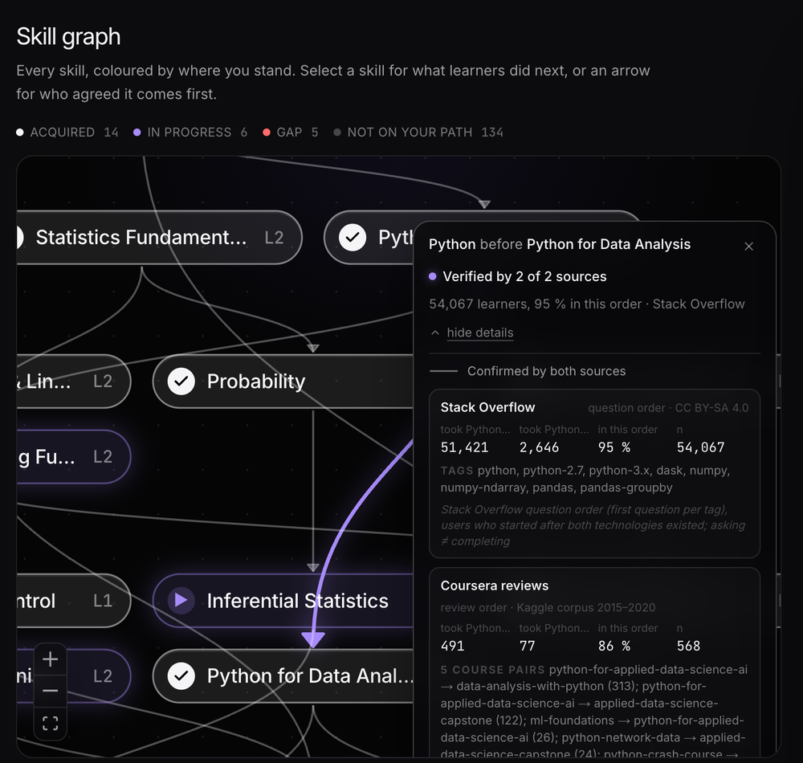
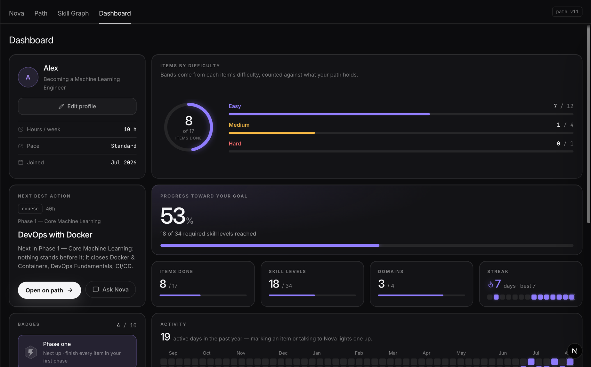

# Pathwise

AI-powered personalized learning path recommender. A deterministic knowledge-graph and
embedding engine decides what to learn and in what order; a conversational mentor built on
the Claude API elicits your goals and explains every recommendation from the engine's own
evidence.

**Live:** https://trypathwise.vercel.app, sign in with any Google account, no setup.





## Stack

Next.js 16 (App Router) · TypeScript · Tailwind CSS 4 · shadcn/ui · Drizzle ORM + Neon
Postgres · Anthropic API · Vitest

## Setup

1. `npm install`
2. Copy `.env.example` to `.env.local` and fill in the values.
3. `npm run db:migrate` to apply migrations to your Postgres database.
4. `npm run dev` and open http://localhost:3000
5. Sign in once at http://localhost:3000, then run `npm run seed you@example.com` to load
   a demo learner with six weeks of generated history: an intake card, every feedback
   kind, the replans they produced, and streaks. The learner attaches to the Google
   account you signed in with, so the sign-in has to come first. Re-running the script
   replaces the previous copy.

## Environment variables

| Name | Purpose |
| --- | --- |
| `DATABASE_URL` | Neon Postgres pooled connection string |
| `ANTHROPIC_API_KEY` | Anthropic API key for the mentor / LLM layer |
| `AUTH_SECRET` | Random secret Auth.js uses to sign session cookies (`npx auth secret` or `openssl rand -base64 32`) |
| `AUTH_GOOGLE_ID` | OAuth client id from Google Cloud (see "Sign-in") |
| `AUTH_GOOGLE_SECRET` | OAuth client secret from Google Cloud |
| `AUTH_URL` | Production only: the deployed origin, e.g. `https://pathwise.example.app`. Leave empty locally |

All of them live in `.env.local` locally (gitignored) and in Vercel project env vars in
production. None is ever committed.

## Sign-in

Everyone signs in with an existing Google account before using the app; the landing page
stays public. Auth.js (`next-auth` v5) with the Google provider and database sessions in
the `users` / `accounts` / `sessions` / `verification_tokens` tables. Each learner belongs
to one Google user (`learners.user_id`); one account can have many learners, and the
picker at `/learn` lists them. A learner URL that belongs to someone else answers 404,
never 403. The engine, the evidence layer and the deterministic core know nothing about
users. We only ask Google for `openid`, `email` and `profile`.

Setting up the Google side from scratch:

1. Open https://console.cloud.google.com, create a project (e.g. `pathwise`) and select it.
2. **APIs & Services → OAuth consent screen** (Google now calls this "Google Auth
   Platform → Branding / Audience"). App name `Pathwise`, a support email, your email as
   developer contact. User type **External**.
3. **Scopes:** add only `openid`, `.../auth/userinfo.email` and `.../auth/userinfo.profile`.
   No sensitive or restricted scopes, so Google never needs to review the app.
4. **Publish the app** (Audience → *Publishing status* → **Publish**, confirm). A consent
   screen left in "Testing" only admits up to 100 listed test users; any other Google
   account is refused at the Google prompt. Publishing with non-sensitive scopes is
   immediate and needs no verification.
5. **Credentials → Create credentials → OAuth client ID**, type **Web application**.
   Authorised JavaScript origins: `http://localhost:3000` and the production origin.
   Authorised redirect URIs: `http://localhost:3000/api/auth/callback/google` and
   `https://<production-origin>/api/auth/callback/google`. Create, then copy the client id
   and client secret.
6. Put them in `.env.local` as `AUTH_GOOGLE_ID` / `AUTH_GOOGLE_SECRET`, generate an
   `AUTH_SECRET`, and add all three (plus `AUTH_URL` = the production origin) to the
   Vercel project env for Production and Preview. Redeploy.
7. Apply the migration (`npm run db:migrate`) if the auth tables are not there yet.
8. Check with a Google account that is **not** the project owner's: open the production
   URL, sign in, create a learner, chat, sign out, sign in again — everything should still
   be there. If that account is refused with "access blocked", the consent screen is not
   published (step 4).

## Scripts

| Command | Purpose |
| --- | --- |
| `npm run dev` | Dev server |
| `npm run build` | Production build |
| `npm test` | Vitest suite |
| `npm run typecheck` | TypeScript, no emit |
| `npm run lint` | ESLint |
| `npm run seed <email> [name]` | Seed the demo learner (six weeks of real engine history) onto an existing signed-in Google account; re-running replaces the copy |
| `npm run db:generate` | Generate a migration from `src/db/schema.ts` |
| `npm run db:migrate` | Apply migrations |

## Data pipeline

`pipeline/` is an offline Python (uv) pipeline; everything it produces is committed as small
JSON under `src/data/` and `pipeline/evidence/`, and nothing in it runs at request time.
`python pipeline/validate.py` re-checks the committed data and writes
`pipeline/validation-report.json`, which the Vitest suite pins, so `npm test` fails on drift.
`pipeline/refresh.sh` runs the whole pipeline in order — see [Keeping it fresh](#keeping-it-fresh).

The evidence stages run in this order (each is documented below; raw inputs never enter the
repo, and a stage whose raw inputs are absent is skipped — its committed outputs stand):

```
python pipeline/mine_so.py run --project <gcp-project> && python pipeline/mine_so.py emit   # Stack Overflow -> evidence/edges_so.json, branches_so.json
python pipeline/mine_coursera.py run     # Coursera -> evidence/edges_coursera_course.json, branches_coursera_course.json
python pipeline/tag_courses.py tag       # Ring-1 course -> skill tags -> evidence/course_skill_tags.json (gated, see below)
python pipeline/pool.py run              # course edges -> skill edges + branch shares -> evidence/edges_coursera.json, branches_coursera.json
python pipeline/merge_edges.py run       # authored ∪ mined -> src/data/skill_edges.json, branches.json, evidence/agreement_report.md
python pipeline/validate.py              # schema, DAG over path-driving edges, evidence integrity -> validation-report.json
```

**What the evidence says today** (`pipeline/evidence/agreement_report.md`, computed, not typed):
> Of the 193 authored prerequisite edges, 188 were observable in real learner sequences (Stack Overflow question order for 186, Coursera review order for 84); 39.4 % of the observable edges were confirmed by at least one source and 5.9 % by both; 6 contradictions were raised and 6 resolved; 0 novel edges were promoted after human review.

### Learner-sequence evidence — Stack Overflow

`pipeline/mine_so.py` mines the order in which real learners first asked about each skill on
Stack Overflow and writes `pipeline/evidence/edges_so.json` (directional pair counts per
skill pair: support, reverse, confidence, n) and `pipeline/evidence/branches_so.json`
("what did learners ask about next", as transition shares). Tags map to skills through the
hand-built `pipeline/sources/tag_skill_map.json`, which two people check row by row; no
language model is involved anywhere in this source. Cohort rule, in one sentence: for a pair
of skills (A, B) only users whose first-ever question came at least 12 months after both
technologies existed on the site are counted, so that "newer thing comes later" cannot pass
for "prerequisite". Every number carries the caveat that asking is not completing.

```
python pipeline/mine_so.py check --project <gcp-project>   # mirror reachability, MAX(creation_date), tag presence
python pipeline/mine_so.py run   --project <gcp-project>   # BigQuery: pairs / branches / skills -> pipeline/build/so/*.csv
python pipeline/mine_so.py render-sede                     # LLM-era top-up queries for the Stack Exchange Data Explorer
python pipeline/mine_so.py emit                            # CSVs -> pipeline/evidence/edges_so.json, branches_so.json, so_stats.md
```

The queries run against the BigQuery public mirror `bigquery-public-data.stackoverflow`
(the SQL is in `pipeline/sql/`); because that mirror ends in 2022, pairs involving LLM-era
skills are re-measured on current data with a Stack Exchange Data Explorer query over a 5 %
user sample, run by hand in the browser. Raw query results stay in the gitignored
`pipeline/build/`; only the aggregated files under `pipeline/evidence/` are committed, and
they are byte-identical for identical inputs.

Stack Overflow content is licensed under [CC BY-SA 4.0](https://creativecommons.org/licenses/by-sa/4.0/)
(see [Stack Overflow's licensing terms](https://stackoverflow.com/help/licensing)); Pathwise
publishes aggregate counts only, with attribution wherever they are shown.

### Learner-sequence evidence — Coursera

`pipeline/mine_coursera.py` reproduces Riyan Garg's review-order mining over the Kaggle
corpus [Course Reviews on Coursera](https://www.kaggle.com/datasets/imuhammad/course-reviews-on-coursera)
(imuhammad; 1.45 M reviews of 623 courses, 2015–2020, CC0). Each reviewer display name is a
pseudo-learner and the order of their reviews stands in for the order they took the courses:
literal duplicate rows are dropped (the scrape repeats most reviews two to five times), the
placeholder "By Deleted A" is dropped, names with 2–15 distinct reviews are kept, and per name
every ordered pair of distinct courses is counted once by first review date (same-day pairs
carry no order and are dropped). A course pair becomes an edge at support ≥ 20 and
confidence = AB/(AB+BA) ≥ 0.85 — his own recommended floor, after his 0.70 run kept
cross-topic coincidences. The run recomputes his published 0.70 baseline from the same rows
(it reproduces exactly) so the cost of the higher floor is visible in
`pipeline/evidence/coursera_stats.md`, and asserts that his four within-specialization
chains survive and his three cross-topic chains do not.

```
mkdir -p pipeline/build/coursera && cd pipeline/build/coursera
curl -L -o coursera.zip https://www.kaggle.com/api/v1/datasets/download/imuhammad/course-reviews-on-coursera
unzip coursera.zip && rm coursera.zip && cd ../../..     # Coursera_reviews.csv, Coursera_courses.csv (gitignored)
python pipeline/mine_coursera.py run                    # -> pipeline/evidence/edges_coursera_course.json, coursera_stats.md
```

One streaming pass, ~8 s and ~450 MB peak memory on an 8 GB laptop; review text is hashed
for the duplicate check and never leaves `pipeline/build/`. The output is course-level
(`fromCourseId → toCourseId` with support, reverse, n, confidence) and byte-identical for
identical inputs; the caveat "sequences reconstructed from review order; pseudo-users by
reviewer name" travels with every number.

### Course → skill tags — Coursera Ring 1

Course-level edges only become skill evidence through a course → skill table, so that table is
made inspectable. `pipeline/tag_courses.py` tags Ring 1 (every course in a mined edge) with
skills from the closed vocabulary in `src/data/skills.json` — the skill id is an enum in the
structured-output schema, the same mechanism the app's goal mapper uses — using
`claude-sonnet-5` at low effort in two passes with different objectives: pass A names the
skills a course teaches and at what level, pass B sees only the course text and A's list and
tries to refute each claim. A tag survives only if B does not refute it; any disagreement marks
the course `low` confidence for a mandatory human look. A granularity guard then drops a
direct prerequisite carried at the same level as its dependent unless the course text names it
or B judged it taught in its own right. Inputs are the course name, institution, URL and the
public description read from the Coursera page (name and institution alone when the page is
gone). Model calls are cached under `pipeline/build/`, token usage is summed into the output,
and `pipeline/sources/coursera_catalog_map.json` (hand-built) links each mined course to the
catalog item it belongs to.

```
python pipeline/tag_courses.py fetch       # course pages -> pipeline/build/coursera/descriptions.json
python pipeline/tag_courses.py tag         # two passes + guard -> pipeline/evidence/course_skill_tags.json
python pipeline/tag_courses.py spotcheck   # stratified 20 % blind sample -> pipeline/build/spotcheck_v2.md
python pipeline/tag_courses.py score pipeline/build/spotcheck_v2.md   # Jaccard + exact-level agreement vs the gates
```

The tags are gated, not assumed. A stratified 20 % sample of Ring 1 is checked blind against
the pipeline's tags and the file ships only if reviewer–model skill-set agreement (mean
Jaccard) is ≥ 0.85; below the gate the inputs, prompts or guard are fixed and the ring is
re-run and re-sampled (the first run failed at 0.80 on truncated descriptions and was re-run
on the full course pages). For the shipped file the check was done by one reviewer with an
independent, context-free model pass as a second opinion (`pipeline/sources/coursera_tag_resolutions.json`
records every adjudication); the file states that process and its numbers in its `spotCheck`
block — it does not claim a two-person human check.

### Pooling and merge — the tiered skill graph

`pipeline/pool.py` lifts the Coursera course edges to skill level through the Ring-1 tags: a
course edge pools onto every (skill taught by the from-course, skill taught by the to-course)
pair, both orientations are combined, and each pooled edge keeps support, reverse, confidence,
the number of distinct course pairs behind it and the top-5 course pairs. Its first output is
the measured histogram `pipeline/evidence/pooled_support_histogram.md`; pairs outside the
authored prerequisite closure are listed in `cross_domain_candidates.md` rather than dropped.
Course-level immediate-successor counts lift the same way into transition shares
(`branches_coursera.json`), under the same floors as the Stack Overflow branches (listed at
n ≥ 5, `minSupportMet` at nTotal ≥ 50, shrunk with α = 20).

`pipeline/merge_edges.py` annotates every authored edge (`skills.json.prereqs`) with each
source's numbers and gives it a status — `confirmed-both`, `confirmed-one-source`,
`contradicted-in-review` (a source shows the opposite direction at confidence ≥ 0.85, n ≥ 50)
or `no-data` — and writes every mined pair with no authored counterpart as a `candidate`
(`drivesPath: false`). Authored edges drive paths; evidence annotates them; nothing automatic
flips, removes or promotes an edge. Humans record decisions in
`pipeline/sources/evidence_resolutions.json`; `contradictions.md` and `promotions.md` are
rendered from the queues plus those decisions, and a recorded promotion is applied only if the
edge still meets the thresholds, keeps level bands monotone and keeps the path-driving graph
acyclic (the merge refuses otherwise). Outputs: `src/data/skill_edges.json`,
`src/data/branches.json`, `pipeline/evidence/agreement_report.md/.json`.

In the product, `skill_edges.json` is the only prerequisite source the engine reads, and only
its path-driving edges (`drivesPath: true` — authored ∪ human-promoted), walked in file order,
which is why the merge keeps authored edges in `skills.json` order. Every path item carries
`learnerEvidence`: for each skill it teaches, the numbers of every source that observed the
path-driving links that skill sits on, each with its caveat. The evidence card shows one line
from it ("Confirmed by N learner sequences (P % took these in this order)", with the sources
and caveats on hover), the skill graph styles every link by its status and opens a provenance
popover with each source's support, reverse, confidence, n, tags or course pairs and caveat,
and the narrator may cite numbers from that block only. Mined candidates that meet the
promotion thresholds are drawn dotted around a selected skill; they never shape a path.

`branches.json` answers "what did learners do next" per skill and per source, as transition
shares only (never a rating): a share is listed at n ≥ 5 and a skill shows anything at all only
when that source saw nTotal ≥ 50 learners, shrunk toward a uniform prior over the observed
next-skills (α = 20). Selecting a skill in the graph opens the overlay — up to four next-skills
per source with share and n, out-of-catalog steps greyed but never hidden, the caveat under each
list, and "not enough learner data on this step" below the floor. On the evidence card, when a
skill the learner already has lists the item's primary skill as a next step above those floors,
the card adds "Learners like you: P % took this next (n = …)" with the population, source and
caveat on hover, and the narrator may cite that share and n from the same block. Branch shares
are evidence and display; they never reorder a path.

### Self-evaluation — `pipeline/evaluate/`, `docs/EVALUATION.md`

Three measurements, each produced by a committed script and quoted verbatim in
`docs/EVALUATION.md`; nothing is trained. All three start from the same corpus of generated
paths — the five fixture learners plus every goal template under three canonical profiles
(empty, partial, time-poor), 50 paths — emitted by `pipeline/evaluate/dump_paths.ts`, which
runs the engine exactly as the product does.

```
python pipeline/evaluate/sequencing_agreement.py     # engine order vs observed learner order, per source -> evidence/eval_sequencing_agreement.md/.json
python pipeline/evaluate/embedding_bakeoff.py        # five local embedding models, P@1 / P@3 / MRR on skillsTaught -> evidence/eval_embedding_bakeoff.md/.json
python pipeline/evaluate/narration_groundedness.py   # 60 narrations -> checker pass -> unsupported-claim rate -> evidence/eval_narration_groundedness.md/.json
```

- **Sequencing agreement**: every ordered pair of taught skills the engine sequenced, checked
  against the majority direction a source observed above its floor (n ≥ 20), split by whether
  the pair is an authored edge, a graph-derived order or unrelated — because the engine's order
  is partly derived from the same authored graph the sources already confirmed.
- **Embedding bake-off**: for each catalog item, all 159 skills ranked by cosine to the item text
  and scored against its annotated `skillsTaught`; candidates run locally (MPS), and a paired
  bootstrap over items decides whether a candidate is clearly better than the shipped MiniLM on
  all three metrics. The shipped model changes only after that and a reviewed fixture-snapshot
  diff.
- **Narration groundedness**: 60 evidence objects narrated the way `POST /api/explain` narrates
  them (`pipeline/evaluate/narrate.ts` runs the same function, prompt, model and effort), then a
  second model pass with a different objective flags every claim not traceable to a field of the
  evidence object or the profile summary; model calls are cached under `pipeline/build/`, token
  usage is summed into the report.

## Keeping it fresh

Kept fresh by machines, kept true by people: the machines re-run the pipeline, probe the
links and watch for drift; every change to the shipped data still goes through the pipeline
scripts, the validator and a human commit. Nothing below writes to `src/data/`, the skill
taxonomy or the prerequisite edges on its own, and nothing runs at request time.

```
pipeline/refresh.sh   # curate -> annotate -> embed -> mine -> tag -> pool -> merge -> validate
```

One entry point for the whole offline pipeline. Stages whose raw inputs are absent — the
BigQuery result CSVs, the Kaggle Coursera CSVs, the fetched course descriptions plus an
`ANTHROPIC_API_KEY` — are skipped with a printed notice and their committed outputs stand,
so the script is safe to run on a fresh clone. It ends with a per-stage ran/skipped summary;
a clean `git status` afterwards means the committed data already matched what the pipeline
produces (verified: with every raw input present, a full run is byte-identical).

Two scheduled GitHub Actions, both also runnable on demand via `workflow_dispatch`:

- **link-check** (weekly) runs `pipeline/curate.py --check-urls` over every catalog URL and
  uploads the full log as a `link-check-report` artifact. Hosts that block scripted requests
  (403/405/429/999, local SSL-chain failures) are reported as unverifiable, not dead; the run
  fails only on URLs that are genuinely gone.
- **drift-check** (nightly) regenerates the five seeded fixture learners' paths with the
  committed engine and data and diffs them against the committed Vitest snapshots — the same
  `tests/engine/fixtures.test.ts` that `npm test` runs, with no snapshot updating in CI. A red
  run is the drift alarm: something changed a generated path.

Note: GitHub pauses scheduled workflows after 60 days without repository activity; a push or
a manual dispatch resumes them.

## Data sources and attribution

- **Stack Overflow** question metadata via the BigQuery public dataset (`bigquery-public-data.stackoverflow`) and the Stack Exchange Data Explorer, licensed [CC BY-SA 4.0](https://creativecommons.org/licenses/by-sa/4.0/) — Pathwise publishes aggregate counts only, with this attribution wherever they are shown.
- **Coursera** review order from the Kaggle dataset [Course Reviews on Coursera](https://www.kaggle.com/datasets/imuhammad/course-reviews-on-coursera) (imuhammad), CC0 — only review order is used; review text never leaves the gitignored build directory.
- The learner-sequence mining method, its measured validation (successes and failures shown side by side) and the "neither graph is strictly superior — use both and say which" conclusion are **Riyan Garg's**; Pathwise reproduces his method in the repository and credits it wherever the Coursera numbers appear.
- Catalog items link to their original providers (Coursera, edX, freeCodeCamp, Kaggle, official documentation, YouTube); Pathwise stores titles, URLs and its own annotations, never course content.
