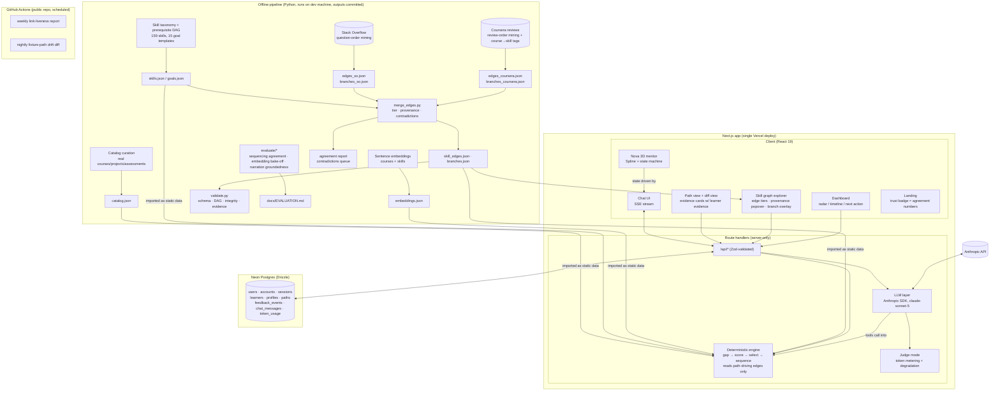

# Pathwise — Solution Documentation

**AI-Powered Personalized Learning Path Recommender**

Live: https://trypathwise.vercel.app · Repository: this repo · Measured numbers: `docs/EVALUATION.md`

> Every number in this document carries the committed file it was read from. Nothing is
> asserted that a committed script did not produce.

---

## 1. Problem understanding

The brief asks for a system that talks to a learner, understands them, and hands back a
sequenced plan they can act on. Six things must exist:

| # | The requirement, in plain language | What that means in practice |
|---|---|---|
| 1 | **Talk to me.** A conversational interface that takes a goal in natural language | "I want to become a data engineer, I know some Python" has to become structured intent |
| 2 | **Know me.** A learner-profiling engine: interests, current level, history, objectives | Skill levels with a provenance (stated / inferred / assessed), hours per week, pace, budget, formats |
| 3 | **Recommend real things.** Courses, projects and resources, not categories | Real items with real URLs, chosen against the learner's actual gap |
| 4 | **Order them.** A path generator that respects prerequisites and sets milestones | A directed acyclic skill graph, a topological order, phases a human can see progress through |
| 5 | **Explain yourself.** An assistant that says why each recommendation is there and answers questions | Explanations tied to the same data the ranking used |
| 6 | **Show me where I am.** A dashboard: progress, skills, milestones, next actions | Computed from the profile, the path and the feedback events |

Plus, from the task statement: **adapt** as the learner gives feedback and makes progress.

### The question a judge actually asks

Any of these six can be faked with a plausible-sounding model output. The question that
separates a demo from a product is:

> **"Why should I believe this order of courses?"**

A recommender that says "learn X, then Y" is making a claim about the world. Pathwise is
built so that claim can be inspected: the order comes from a hand-built prerequisite graph,
the graph itself has been checked against millions of real learner sequences, every arrow
carries its provenance and its counts, and the parts where the evidence disagrees with us
are published rather than hidden.

---

## 2. Approach — the design thesis

> **The LLM is the interface and the narrator. A deterministic engine is the decision-maker.
> Every recommendation is traceable to arithmetic.**

Three consequences follow, and the whole architecture is downstream of them:

1. **The model never ranks a course.** It elicits the profile, maps a free-text goal onto a
   closed skill vocabulary, calls the engine as tools, and narrates the engine's own evidence
   object. It cannot invent an item, reorder a path, or edit the profile directly.
2. **The engine is pure.** Data in, data out, no I/O, no network, no model. It is unit-tested
   against five fixture learners with snapshot-pinned paths and a 66-profile property sweep.
   The same inputs always produce the same path.
3. **The evidence is precomputed and committed.** All mining, tagging, embedding and merging
   happens offline in Python; the outputs are small JSON files in the repository. Nothing in
   the pipeline runs at request time.

The product is therefore a **glass box**: a judge can open `src/engine/score.ts`, read six
weights that sum to 1.0, and reconstruct by hand why a given course is item three.

---

## 3. Architecture



*source: `ARCHITECTURE.md` §1*

**Layer 1 — the offline Python pipeline.** `pipeline/` curates the catalog, annotates it,
embeds it, mines the two learner-sequence sources, tags Coursera courses onto the closed skill
vocabulary, pools course-level edges up to skill level, merges everything into a tiered
prerequisite graph, and validates the result. Its outputs are small committed JSON files under
`src/data/` and `pipeline/evidence/`. Raw inputs (BigQuery result CSVs, the Kaggle review
corpus, fetched course pages) never enter the repository. `python pipeline/validate.py`
re-checks the committed data and writes a report the Vitest suite pins, so `npm test` fails on
drift.

**Layer 2 — the deterministic engine.** `src/engine/` is pure TypeScript with zero I/O:
`gap.ts` → `score.ts` → `select.ts` → `sequence.ts`, plus `evidence.ts`, `replan.ts`,
`dashboard.ts`, `profile.ts`, `similarity.ts`. It imports nothing from `llm/`, `db/` or
`app/`. It reads only the path-driving edges of the skill graph (authored ∪ human-promoted).

**Layer 3 — the LLM layer.** `src/llm/` uses the Anthropic SDK with model `claude-sonnet-5`
for exactly four jobs: the chat turn (a manual tool-use loop whose tools are engine
functions), extracting profile operations from what the learner says, mapping a free-text goal
onto the skill vocabulary, and narrating an evidence object. Structured outputs go through
`client.messages.parse()` against the same Zod schemas the API and the engine use. Prompts are
frozen and prompt-cached. Judge mode meters every response into `token_usage` and degrades
gracefully past a cap.

**Layer 4 — the app.** Next.js 16 App Router with Zod-validated route handlers, Auth.js v5
with Google sign-in and database sessions, Drizzle ORM over Neon Postgres, deployed as a
single Vercel project. Static data is bundled with the deploy: no runtime Python, no runtime
embedding call, no runtime mining.

*source: `ARCHITECTURE.md` §2, §3, §5, §8; `README.md` "How it is built"*

---

## 4. AI/ML techniques — the glass box

### 4.1 What the system actually is

Pathwise is a **hybrid knowledge-graph + embedding recommender** wrapped in an LLM interface.
Precisely:

> The ranker is a deterministic hybrid scorer: four signals computed from the profile and the
> catalog; one cosine similarity over pre-trained MiniLM embeddings, chosen by a measured
> five-model bake-off; and one empirical transition prior mined from the sequences of over two
> million Stack Overflow and Coursera learners, shrunk toward a uniform prior, floored, and
> weighted 0.02. Nothing is fitted to Pathwise's own users, because Pathwise does not have any
> yet — that is stated as a limitation, not disguised as a feature.

We do not train a model. Pre-trained models are *used* (Claude for structured extraction,
goal mapping, offline tagging and narration; sentence-transformer embeddings for similarity);
the mining is descriptive statistics whose every count is inspectable; no weights are fitted
that decide a learner's path.

*source: `ARCHITECTURE.md` §16.4; `docs/EVALUATION.md` preamble ("Nothing here is trained")*

### 4.2 The four-stage engine

| Stage | File | What it does |
|---|---|---|
| **1. Gap** | `src/engine/gap.ts` | Goal skills, level-aware, plus the transitive prerequisite closure over path-driving edges. Each gap skill records `reason` (`goal` / `prereq-of:<skill>`) and the `graphPath` that made it necessary |
| **2. Score** | `src/engine/score.ts` | Every catalog item that advances at least one gap skill gets a six-part score, all components retained |
| **3. Select** | `src/engine/select.ts` | Greedy weighted set-cover: repeatedly take the item maximising (uncovered gap levels taught × score / duration) until the gap is covered or the time budget is spent. Projects attach one per phase; assessments at phase boundaries |
| **4. Sequence** | `src/engine/sequence.ts` | Topological sort over the path-driving skill DAG, ties broken by difficulty then duration; phases cut at graph levels, each with a milestone |

*source: `ARCHITECTURE.md` §5.1–5.4*

### 4.3 The scoring formula

```
score = w_cov  · gapCoverage      // Σ gap levels the item advances / Σ gap levels missing
      + w_lvl  · levelFit         // 1 − |item difficulty − ideal| / 4
      + w_pref · preferenceFit    // format, cost, duration vs hours/week; dislike memos halve it
      + w_qual · qualityPrior     // curated
      + w_sim  · cosine(itemVec, goalCentroid)   // MiniLM embeddings, goalCentroid = mean gap-skill vector
      + w_tp   · transitionPrior  // shrunk share of real learners who went from a held skill into this item's primary gap skill
```

`ENGINE_WEIGHTS`, exported from one constant and shipped as:

| signal | weight | where it comes from |
|---|---|---|
| `coverage` | **0.40** | gap arithmetic |
| `levelFit` | **0.15** | profile levels vs item difficulty |
| `preferenceFit` | **0.13** | stated preferences and dislike memos |
| `quality` | **0.10** | curated `qualityPrior` |
| `similarity` | **0.20** | cosine over pre-trained MiniLM embeddings |
| `transitionPrior` | **0.02** | mined learner behaviour, read from `src/data/branches.json` |

*source: `src/engine/score.ts` (`ENGINE_WEIGHTS`, verified shipped); `ARCHITECTURE.md` §5.2*

The weights sum to 1.0, so `breakdown.total` stays on a 0–1 scale; `transitionPrior` was
funded out of `preferenceFit` (0.15 → 0.13), not added on top. All six components are logged
per candidate into the Evidence object and rendered as a bar set on the item card. The weights
were set by judgement, not tuned — and how much that matters was measured (§6.4).

The transition prior reads through the *same* lookup the evidence card calls, on the same
primary gap skill, with the same known-skills filter, so **the number that moved the score is
exactly the number the learner is shown**. It is zero unless a source observed the transition
above its floors — absence of evidence contributes nothing rather than penalising.

*source: `src/engine/score.ts` (`transitionPrior()`); `ARCHITECTURE.md` §5.2*

### 4.4 Catalog and graph, as shipped

| Quantity | Value |
|---|---|
| Catalog items | **370** — 307 courses, 36 projects, 27 assessments |
| Skills | **159**, across 10 domains |
| Goal templates | **15** |
| Authored prerequisite edges | **193** (all path-driving) |
| Total edges in the tiered graph | **8,412** — 193 authored + 8,219 mined candidates (display only) |
| Embedding vectors | **529** (370 items + 159 skills), 384-dimensional |

*source: `src/data/catalog.json`, `src/data/skills.json`, `src/data/goals.json`,
`src/data/skill_edges.json` (`stats` block), `src/data/embeddings.json`*

### 4.5 LLM techniques

- **Structured outputs, not JSON scraping.** `client.messages.parse()` with Zod schemas for
  `ProfileOp[]`, `MappedGoal`, `ProfileCard` and the offline `CourseTag`. The skill id is an
  enum built from the live skill list, so the model literally cannot emit a skill that does
  not exist. No JSON-repair retry loops.
- **Prompt caching.** `prompts.ts` exports frozen system prompts — no timestamps, no
  interpolated user data; dynamic context goes into message turns. The chat system prompt
  carries `cache_control: {type: "ephemeral"}` and cache reads are verified via
  `usage.cache_read_input_tokens`.
- **Effort levels.** `low` for chat turns, extraction, narration and offline tagging;
  `medium` for full path-context reasoning and for the offline groundedness checker.
- **A tool-use loop whose tools *are* the engine.** `get_profile`, `apply_profile_ops`,
  `map_custom_goal`, `generate_path` / `replan_path`, `explain_item`, `search_catalog`,
  `get_dashboard_summary`, `propose_profile_card`. Capped at six tool iterations per turn.
  The model's only route to the outside world runs through the engine or the judge-mode gate.
- **Grounded narration rendered beside structural evidence.** `/api/explain` prompts the model
  with only the Evidence object and a one-paragraph profile summary; numbers may be cited only
  from the `learnerEvidence` block. The narration is displayed *next to* the structural
  rendering of the same object, so any drift is visible rather than authoritative. Its
  groundedness is measured, not asserted (§6.3).
- **Degradation as a designed feature.** Every response is metered into `token_usage`. Per
  Google account, `JUDGE_USER_DAILY_TOKENS` per UTC day (default **150,000**); per deployment,
  `JUDGE_GLOBAL_DAILY_TOKENS` (default **3,000,000**); `/api/chat` also allows at most ten
  turns per learner per minute. Past a cap or on a model error, routes answer
  `{degraded: true}`, Nova rests, and everything deterministic keeps working — path
  generation, feedback and replanning, structural and provenance explanations, the graph
  explorer and the dashboard. The product degrades to a working recommender, not a blank
  screen. Run the dev server with `ANTHROPIC_API_KEY=invalid` to see it end to end.

*source: `ARCHITECTURE.md` §8.1–8.4; `README.md` "Judge mode" and env-var table*

---

## 5. The evidence layer — we checked our hand-built graph against real learners

This is the part of Pathwise that answers the judge's implicit question directly.

### 5.1 The claim

A hand-built prerequisite graph is an opinion. So we went and measured it against what real
learners actually did, in two independent behavioural corpora, and published the result
including the places where the learners disagree with us.

### 5.2 The admission bar

A source is admitted only if it has **all five**: (1) a person identifier that persists across
items; (2) timestamps; (3) topic granularity that maps to our 159 skills; (4) a licence that
allows derived aggregate statistics; (5) verifiability by our own reviewers. Row count without
(1) and (2) is noise with a large n — worse than honest thinness. Corpora with real behaviour
but tiny node sets, or with no stated licence, or whose tagging our reviewers could not check,
were ruled out on the record rather than used quietly.

*source: `ARCHITECTURE.md` §15.1*

### 5.3 Source A — Stack Overflow question order

For each user, the date of their **first question** carrying each tag. If a user's first
Python question precedes their first pandas question, that is one vote for `python → pandas`.
Tags map to skills through a hand-built table checked row by row by two people; no language
model is involved anywhere in this source.

**The cohort-bias filter, in one sentence:** newer technologies always appear "after" older
ones inside the same user's history, so for a pair (A, B) we count only users whose
first-ever question came at least 12 months after both technologies existed on the site —
which is what stops "newer thing" from passing for "prerequisite". Same-day ties carry no
order and are dropped.

| | before the filter | after |
|---|---|---|
| Pairs at the n ≥ 20 floor | 8,709 | **8,260** |
| Ordered observations | 26,404,750 | **23,707,403** |
| Same-day ties dropped | 3,413,791 | |

| Coverage | Value |
|---|---|
| Users with questions | 4,657,919 |
| Users with any mapped skill | 3,536,377 |
| **Eligible users** | **2,137,848** |
| Skills mapped / observed | 153 / 153 (of 159 skills) |
| Pairs seen / at floor | 10,174 / 8,260 |
| Authored edges with both endpoints observed | 186 of 193 |

*source: `pipeline/evidence/so_stats.md`*

Because the BigQuery public mirror ends in 2022, pairs involving LLM-era skills are re-measured
on current data through a Stack Exchange Data Explorer top-up (56,192 ordered observations,
82 pairs at floor across 13 LLM-era skills).

*source: `pipeline/evidence/so_stats.md`, "LLM-era top-up"*

### 5.4 Source B — Coursera review order

Each reviewer display name is a pseudo-learner and the order of their reviews stands in for
the order they took the courses. Literal duplicate rows are dropped (the scrape repeats most
reviews two to five times), the "By Deleted A" placeholder is dropped, names with 2–15
distinct reviews are kept, and per name every ordered pair of distinct courses is counted once
by first review date; same-day pairs are dropped. A course pair becomes an edge at support
≥ 20 and confidence = AB/(AB+BA) ≥ 0.85.

| | Value |
|---|---|
| Rows total / literal duplicates dropped | 1,454,711 / 931,282 |
| Distinct rows / rows used | 518,017 / 251,711 |
| Distinct names / names with pairs | 287,807 / 72,774 |
| Ordered pairs seen | 109,413 |
| Pairs at the support floor | 2,939 |
| **Course edges kept at 0.85** | **290** over **170** courses |
| Courses in corpus | 623 |

*source: `pipeline/evidence/coursera_stats.md`*

### 5.5 Failures shown next to successes

The higher 0.85 confidence floor exists because the lower 0.70 floor keeps cross-topic
coincidences. The run asserts both directions of that claim, and reports either way.

**Genuine chains that survive at 0.85 (shipped rows):**

| Chain | Example step | support vs reverse | conf |
|---|---|---|---|
| python-for-everybody | Programming for Everybody → Python Data Structures | 1,867 vs 235 | 0.8882 |
| python-for-everybody | Python Data Structures → Using Python to Access Web Data | 1,592 vs 148 | 0.9149 |
| ibm-cybersecurity | Intro to Cybersecurity Tools → Cybersecurity Roles, Processes & OS Security | 104 vs 7 | 0.9369 |
| uci-project-management | Initiating and Planning Projects → Budgeting and Scheduling Projects | 259 vs 19 | 0.9317 |
| ml-to-tensorflow | Machine Learning → Convolutional Neural Networks in TensorFlow | 61 vs 6 | 0.9104 |

**Nonsense chains the 0.85 floor kills:**

| Chain | Step | support vs reverse | conf | verdict |
|---|---|---|---|---|
| food-health-python-css | Stanford Introduction to Food and Health → Python Data Structures | 54 vs 55 | 0.4954 | not kept |
| food-health-python-css | Python Data Structures → Introduction to CSS3 | 74 vs 54 | 0.5781 | not kept |
| customer-analytics-deep-learning | Customer Analytics → Neural Networks and Deep Learning | 59 vs 36 | 0.6211 | not kept |
| python-css | Python Data Structures → Introduction to CSS3 | 74 vs 54 | 0.5781 | not kept |

The report records **all four success chains survive: True** and **no nonsense chain survives:
True**.

*source: `pipeline/evidence/coursera_stats.md`, "Chain checks (shipped edge set)"*

### 5.6 Tiered provenance and the promotion policy

Course-level Coursera edges are lifted to skill level through the Ring-1 course→skill tags:
**577** pooled skill→skill edges over **77** skills, of which **471** are cross-domain
candidates listed separately rather than dropped — because that is exactly where coincidence
chains surface, and they are inspected, not hidden.

*source: `pipeline/evidence/pooled_support_histogram.md`; `pipeline/evidence/cross_domain_candidates.md`*

Every authored edge is then annotated with each source's numbers and given a status:

| status | meaning | edges |
|---|---|---|
| `confirmed-both` | both sources confirm the authored direction | **11** |
| `confirmed-one-source` | exactly one confirms, none contradicts | **61** |
| `contradicted-in-review` | a source shows the opposite direction at conf ≥ 0.85, n ≥ 50 | **6** |
| `no-data` | neither confirmed nor contradicted — 26 below floor in every source, 89 observed but inconclusive | **115** |

*source: `src/data/skill_edges.json` (`stats.byStatus`); `pipeline/evidence/agreement_report.md`*

**The policy, stated plainly: humans decide, machines propose.** Authored edges drive paths.
Mined edges annotate them. A mined-only edge becomes path-driving only if pooled confidence
≥ 0.85, support ≥ 50, corroboration by ≥ 2 course pairs or ≥ 2 distinct tags, level bands
stay monotone, the graph stays acyclic, the fixture and property tests stay green, **and a
human ticks it**. Nothing automatic flips, removes or promotes an edge.

*source: `ARCHITECTURE.md` §15.6; `README.md` "Pooling and merge"*

### 5.7 The agreement report — headline, verbatim

> Of the 193 authored prerequisite edges, 188 were observable in real learner sequences (Stack
> Overflow question order for 186, Coursera review order for 84); 39.4 % of the observable
> edges were confirmed by at least one source and 5.9 % by both; 6 contradictions were raised
> and 6 resolved; 0 novel edges were promoted after human review.

*source: `pipeline/evidence/agreement_report.md` (headline paragraph, computed by the pipeline)*

| Metric | Stack Overflow | Coursera | ≥ 1 source | both |
|---|---|---|---|---|
| Observable authored edges | 186 | 84 | 188 | |
| Confirmed (conf ≥ 0.70, n ≥ 20) | 48 | 37 | 74 | 11 |
| Confirmed as % of observable | | | **39.4 %** | **5.9 %** |
| Contradicted (reverse conf ≥ 0.85, n ≥ 50) | 1 | 5 | 6 | |
| Unobserved (below floor everywhere) | | | 26 | |
| Observed but inconclusive | | | 89 | |
| Novel candidates meeting thresholds | 78 | 120 | 194 | |
| Promoted by a human | | | **0** | |
| Skills with data (of 159) | 147 | 77 | 150 | |

*source: `pipeline/evidence/agreement_report.md`*

**We report 39.4 %, not a bigger number.** Low confirmation is still the honest result, and it
is actionable: it points at exactly which authored edges to review.

### 5.8 Here is where they disagree with us

All six contradictions were reviewed and resolved by a person, with the reasoning recorded:

| authored edge | contradicting source | resolution |
|---|---|---|
| CSS → Web Accessibility | Coursera | keep-authored — one Coursera course pair; Stack Overflow confirms the authored direction (0.803, n 1,917) |
| Programming Basics → JavaScript | Coursera | keep-authored — one course pair inside one specialization; Stack Overflow inconclusive at large n |
| Security Fundamentals → Identity & Access Management | Coursera | keep-authored — two course pairs inside one certificate's order; Stack Overflow inconclusive |
| Security Fundamentals → Network Security | Coursera | keep-authored — one course pair inside one chain's order; Stack Overflow inconclusive |
| SQL → Advanced SQL | Coursera | keep-authored — one course pair (2 vs 86); Stack Overflow confirms the authored direction (0.869, n 21,160) |
| Statistics Fundamentals → R Programming | Stack Overflow | keep-authored — Stack Overflow shows R questions before statistics questions (0.136, n 5,539); asking order is not completion order, and the authored ordering is a curriculum choice |

*source: `pipeline/evidence/agreement_report.md`, "Contradictions"*

And the twenty lowest-confidence authored edges are published in full rather than suppressed —
including `statistics-fundamentals → r-programming` at 0.136 (n 5,539) and
`programming-basics → python` at 0.381 (n 43,307).

*source: `pipeline/evidence/so_stats.md`, "20 lowest-confidence authored edges (the noise, not hidden)"*

### 5.9 Attribution

Copied from `README.md`, "Data sources and attribution":

> - **Stack Overflow** question metadata via the BigQuery public dataset
>   (`bigquery-public-data.stackoverflow`) and the Stack Exchange Data Explorer, licensed
>   [CC BY-SA 4.0](https://creativecommons.org/licenses/by-sa/4.0/) — Pathwise publishes
>   aggregate counts only, with this attribution wherever they are shown.
> - **Coursera** review order from the Kaggle dataset
>   [Course Reviews on Coursera](https://www.kaggle.com/datasets/imuhammad/course-reviews-on-coursera)
>   (imuhammad), CC0 — only review order is used; review text never leaves the gitignored
>   build directory.
> - The learner-sequence mining method, its measured validation (successes and failures shown
>   side by side) and the "neither graph is strictly superior — use both and say which"
>   conclusion are **Riyan Garg's**; Pathwise reproduces his method in the repository and
>   credits it wherever the Coursera numbers appear.
> - Catalog items link to their original providers (Coursera, edX, freeCodeCamp, Kaggle,
>   official documentation, YouTube); Pathwise stores titles, URLs and its own annotations,
>   never course content.

*source: `README.md`, "Data sources and attribution" (copied verbatim)*

The reproduction is exact: the pipeline recomputes the published 0.70 baseline from the same
rows — 1,054,450 rows used, 58,939 ordered pairs, 714 pairs at support ≥ 20, 287 edges over
171 courses — and records **reproduces the published numbers exactly: True**.

*source: `pipeline/evidence/coursera_stats.md`, "Riyan's baseline, recomputed from the same CSVs"*

---

## 6. The evaluation harness

Five measurements, each produced by a committed script under `pipeline/evaluate/`, each
writing its result under `pipeline/evidence/`, each quoted verbatim in `docs/EVALUATION.md`.
Nothing is trained; no number is quoted that a script did not produce.

The first three start from the same corpus: the five fixture learners the test suite pins plus
every one of the 15 goal templates under three canonical profiles (empty, partial, time-poor)
— **50 paths**, produced by `pipeline/evaluate/dump_paths.ts`, which runs the engine exactly
as the product does.

*source: `docs/EVALUATION.md`, preamble*

### 6.1 Sequencing agreement — does our order match what learners did?

Every ordered pair of taught skills in those 50 paths is a sequencing decision: **2,732**
unique ordered pairs (6,587 occurrences). Each is looked up in the learner-sequence evidence
and, where a source observed it at n ≥ 20 with a strict majority, checked against the observed
majority direction.

| Source | Pairs observed (n ≥ 20) | Agreement | Authored edges | Graph-derived | Graph-inverted | Unrelated |
|---|---|---|---|---|---|---|
| Stack Overflow question order | 2,265 | **65.4 %** | 95 / 112 (84.8 %) | 167 / 174 (96.0 %) | 4 / 27 (14.8 %) | 1,215 / 1,952 (62.2 %) |
| Coursera review order | 400 | **61.8 %** | 29 / 36 (80.6 %) | 33 / 41 (80.5 %) | 3 / 11 (27.3 %) | 182 / 312 (58.3 %) |

Restricted to pairs that cross a phase boundary: **72.1 %** on Stack Overflow (1,522 pairs)
and **65.9 %** on Coursera (226). Restricted to the pairs the sources are surest about
(n ≥ 50 and a majority of at least 70 %): **78.3 %** on Stack Overflow (474 pairs) and
**61.2 %** on Coursera (281).

*source: `docs/EVALUATION.md` §1; `pipeline/evidence/eval_sequencing_agreement.md`*

**Reading it.** Where the engine's order comes from a prerequisite claim, learners agree
85–96 % of the time on Stack Overflow and 80–81 % on Coursera. Where the engine had no
prerequisite reason for an order — the *unrelated* column, more than four fifths of all
observed pairs — agreement drops to 62 % and 58 %: that order comes from scores and time
budget, and the learner data says it is a little better than a coin toss.

**Where they disagree hardest**, on the pairs the engine claims as prerequisites:

| Engine order | Share of learners in that order | n | Source |
|---|---|---|---|
| Networking & How the Web Works → Working with APIs | 41 % | 15,008 | Stack Overflow |
| Modern JavaScript → Node.js | 35 % | 14,683 | Stack Overflow |
| Statistics Fundamentals → R Programming | 14 % | 5,539 | Stack Overflow |
| Model Evaluation → Neural Networks | 8 % | 5,317 | Coursera |
| SQL → Python | 8 % | 2,276 | Coursera |

*source: `docs/EVALUATION.md` §1; `pipeline/evidence/eval_sequencing_agreement.md`,
"Disagreeing pairs (at the floor)"*

These are candidates for an authoring review, not embarrassments: the order people first ask
about things may simply differ from the order a curriculum teaches them. The Coursera pairs
above came from scoring, not from any prerequisite claim.

**A finding about our own engine, published:** in **35 of 2,732** pairs the engine taught a
skill before one of its own prerequisites — almost always a phase project or a broad course
touching a skill at level 1 before the course teaching its prerequisite arrives (for example
*Cloud Architecture* before *AWS Fundamentals* in five paths), plus cycle-broken soft edges.
Learners side with the graph in those cases, which is the direction the fix should take.

*source: `docs/EVALUATION.md` §1; `pipeline/evidence/eval_sequencing_agreement.md`*

**The confound, stated.** The engine's order is partly *derived* from the authored graph, and
that same graph is what the sources were checked against when the evidence was merged; high
agreement on authored and graph-derived pairs therefore partly re-measures the agreement
report rather than measuring the engine independently. The *unrelated* column is the only one
free of that circularity, and it is the weakest.

*source: `docs/EVALUATION.md` §1, "The confound, stated"*

### 6.2 Embedding bake-off — the challenger won and we kept the incumbent

Ground truth is each item's annotated `skillsTaught` (model-annotated, human spot-checked),
370 items over 159 skills. For every item all 159 skills are ranked by cosine; P@1, P@3 and
MRR are averaged. Because 135 of the 370 items teach a single skill, P@3 cannot reach 1.0 —
its ceiling is 0.644. Five models ran locally on Apple silicon. Each candidate is compared to
the shipped baseline with a paired bootstrap over items (2,000 resamples).

| Model | Dim | P@1 | P@3 (ceiling 0.644) | MRR | Δ vs shipped: P@1 · P@3 · MRR (95 % interval) |
|---|---|---|---|---|---|
| all-MiniLM-L6-v2 (shipped) | 384 | 0.776 | 0.419 | 0.857 | — |
| BAAI/bge-small-en-v1.5 | 384 | 0.757 | 0.408 | 0.838 | −0.019 [−0.059, +0.022] · −0.011 [−0.030, +0.008] · −0.018 [−0.044, +0.007] |
| BAAI/bge-base-en-v1.5 | 768 | 0.795 | 0.420 | 0.859 | +0.019 [−0.013, +0.051] · +0.001 [−0.018, +0.019] · +0.002 [−0.020, +0.024] |
| thenlper/gte-base | 768 | **0.803** | **0.431** | **0.874** | +0.027 [−0.008, +0.065] · +0.013 [−0.004, +0.029] · +0.017 [−0.004, +0.038] |
| nomic-ai/nomic-embed-text-v1.5 | 768 | 0.741 | 0.385 | 0.826 | −0.035 [−0.073, +0.003] · −0.034 [−0.052, −0.016] · −0.031 [−0.055, −0.005] |

*source: `docs/EVALUATION.md` §2; `pipeline/evidence/eval_embedding_bakeoff.md`*

**Decision.** `gte-base` leads on all three metrics — but by +0.027 / +0.013 / +0.017 with
every interval straddling zero: ten more items right at rank 1 out of 370, at twice the vector
size. That is not "clearly better", so the shipped model stays `all-MiniLM-L6-v2` and the
table is the result. The rule that would change it — all three intervals above zero, plus a
reviewed diff of every fixture path the swap would alter — is in the script, written before
the run. By item kind the ranking is stable: courses are easy (MiniLM P@1 0.827), projects and
assessments are hard for every model (P@1 0.44–0.63), because their text describes a task
rather than a topic.

*source: `docs/EVALUATION.md` §2, "Decision"*

### 6.3 Narration groundedness — the flagged rate, published

60 evidence objects are drawn from the corpus (46 courses, 9 projects, 5 assessments; 27 carry
learner-sequence links and 26 a "what learners did next" share) and narrated exactly as
`POST /api/explain` narrates them. A second pass with a different objective then lists every
factual claim not traceable to a field of the evidence object or the profile summary,
classing each as an *invented fact*, a *misstated field* or an *interpretive gloss*.

| Metric | Value |
|---|---|
| Narrations | 60 (mean 127 words, 273 sentences) |
| Narrations with at least one unsupported claim | **37 (61.7 %)** |
| — with an invented fact or a misstated field | **15 (25.0 %)** |
| Unsupported claims | 60 — 11 invented facts, 7 misstated fields, 42 interpretive glosses |
| Unsupported claims per 100 sentences | 22.0 |
| Narrations that cite learner numbers | 37, of which 21 flagged (one misstatement of a number) |
| Cost | narration $0.27; checker $0.80 — about **$1.07** for the pass |

*source: `docs/EVALUATION.md` §3; `pipeline/evidence/eval_narration_groundedness.md`*

**Reading it.** Strict by construction, the checker flags three narrations in five, but the
flags sort cleanly. Seven in ten are interpretive glosses — a quality score of 0.8 narrated as
"a well-regarded resource", an empty `sequencedAfter` as "foundational". The quarter that
matters is the 15 narrations with an invented fact or a misstated field. The learner-sequence
numbers themselves — the counts, shares and source names the narrator is allowed to cite —
were reproduced correctly in **36 of the 37** narrations that used them. Every flagged
sentence is listed in the report. The follow-up is a prompt clause, not a model change.

*source: `docs/EVALUATION.md` §3, "Reading it"*

### 6.4 Weight sensitivity — how much do the hand-set weights matter?

Each of the six weights is moved ±25 % over a 66-learner sweep (983 path items) and every
path regenerated.

| axis | Δ | learners changed | items changed (% of 983) | learners reordered | phase-order flips |
|---|---|---|---|---|---|
| coverage | +25 % / −25 % | 6/66 / 10/66 | 10 (1.02 %) / 40 (4.07 %) | 4 / 6 | 0 / 0 |
| levelFit | +25 % / −25 % | 18/66 / 15/66 | 45 (4.58 %) / 33 (3.36 %) | 3 / 2 | 0 / 0 |
| preferenceFit | +25 % / −25 % | 3/66 / 4/66 | 7 (0.71 %) / 5 (0.51 %) | 1 / 2 | 0 / 0 |
| quality | +25 % / −25 % | 3/66 / 8/66 | 6 (0.61 %) / 23 (2.34 %) | 0 / 1 | 0 / 0 |
| similarity | +25 % / −25 % | 8/66 / 19/66 | 16 (1.63 %) / 47 (4.78 %) | 2 / 7 | 0 / 0 |
| transitionPrior | +25 % / −25 % | 1/66 / 0/66 | 2 (0.20 %) / 0 (0.00 %) | 0 / 0 | 0 / 0 |

*source: `docs/EVALUATION.md` §4; `pipeline/evidence/weight_sensitivity.json`*

At ±25 % no axis moves more than **4.8 %** of items and **no learner's phase order changes**
under any perturbation. Level fit and similarity are the most sensitive axes; the transition
prior is by some distance the least. Most of what a path contains is decided by the gap and
the prerequisite graph before the weights break ties among courses that cover the same skills
— which is the intended division of labour.

### 6.5 The transition prior — a null result, reported

Before this change, the mined behaviour of over two million learners was rendered on screen
and influenced no decision the engine made. Wiring it in as a sixth signal was governed by a
rule written down **before any number was seen**:

> The transition prior ships at weight 0.02 if and only if (a) no fixture path becomes
> indefensible on human review, and (b) the graph-inverted pair count does not rise above 35.
> The weight may be raised above 0.02 only if unrelated-pair agreement improves on both
> sources beyond run-to-run noise with every affected fixture diff reviewed. If agreement does
> not improve, the term ships anyway at 0.02 and the null result is reported.

| Metric | Before | After | Δ |
|---|---|---|---|
| Unrelated pairs, Stack Overflow | 62.2 % (1,215 / 1,952) | 62.2 % (1,215 / 1,952) | **0** |
| Unrelated pairs, Coursera | 58.3 % (182 / 312) | 58.3 % (182 / 312) | **0** |
| Graph-inverted pairs | 35 of 2,732 | 35 of 2,732 | 0 |
| Fixture paths whose contents or order changed | — | 0 of 5 | — |

The prior is non-zero on 397 of 983 path items (40.4 %) and 1,904 of 4,525 scored candidates
(42.1 %), median share 0.036, maximum 0.242 — so at weight 0.02 it contributes at most 0.005
to a total, and typically 0.0007. That is smaller than the gaps between competing candidates,
and it is why nothing moved.

**Conclusion, as published:** a null result. Under the pre-registered rule both conditions for
shipping hold and the condition for raising the weight does not, so the term ships at 0.02 and
the paragraph is the report. We kept it because behavioural evidence should carry some weight
in a scorer that claims to use it, and because at this weight the null result costs nothing.
**We report that it did not measurably improve ordering.**

*source: `docs/EVALUATION.md` §5*

---

## 7. Explainability — the evidence card

Every path item carries an `Evidence` object built by the engine at generation time, not
reconstructed afterwards:

```ts
type Evidence = {
  catalogId: string;
  gapSkillsCovered: { skillId; reason: "goal" | "prereq-of:<skillId>"; graphPath: string[] }[];
  scoreBreakdown: { coverage; levelFit; preferenceFit; quality; similarity;
                    transitionPrior; total };
  sequencedAfter: { catalogId; becauseSkill }[];
  provenance: string;          // the real resource URL
  learnerEvidence?: {          // attached when a covered gap skill sits on an edge with mined data
    edges: { from; to; source; support; reverse; confidence; caveat }[];
    branch?: { from; toThis; nTotal; shareShrunk; source; caveat };
  };
};
```

*source: `src/engine/evidence.ts`; `src/schemas/`; `ARCHITECTURE.md` §7*

**Three renderings, always shown together:**

1. **Structural — cannot hallucinate.** Skill chips on the card; clicking it highlights the
   `graphPath` in the skill graph ("you know *JavaScript* → this unlocks *React* → required
   for *Frontend Developer*"); the six-part score breakdown as a small bar set. Pure client
   rendering of the Evidence object, no model anywhere in the path.
2. **Narrative — grounded.** `/api/explain` prompts `claude-sonnet-5` with only the Evidence
   object and a one-paragraph profile summary: explain using only these facts, introduce no
   claims not present, and cite numbers only from `learnerEvidence`. Low effort, roughly 150
   tokens, in the mentor's voice.
3. **Provenance.** Where learners were observed, one more line — *"Confirmed by N learner
   sequences (P % took these in this order)"* — with a hover listing each source, its counts
   and its caveat. In the graph explorer every edge is styled by its tier and its popover
   shows the same numbers; mined candidates that meet the promotion thresholds are drawn
   dotted around a selected skill and never shape a path.

Because all three render side by side, **narrative drift is visible against the structural
ground truth** rather than authoritative. That is the whole reason the groundedness rate in
§6.3 is publishable: a gloss the reader can check against the numbers beside it is a very
different failure from a confident sentence with nothing next to it.

Two further guards on what the narrator may say: a share is listed only at n ≥ 5 and shown
only where the source saw nTotal ≥ 50 learners, shrunk toward a uniform prior over observed
next-skills; below that the product says "not enough learner data on this step". No
rating-derived satisfaction or difficulty percentage is ever displayed.

*source: `ARCHITECTURE.md` §7, §15.8; `README.md` "Pooling and merge"*

---

## 8. Adaptation — feedback becomes a diff, not a silent rewrite

Push-back is a first-class input. Marking an item done, too hard, too easy or not for you runs
deterministic rules — no model involved — that mutate the profile and decide whether to
regenerate:

| Event | Effect on the profile | Replan? |
|---|---|---|
| `completed(item)` | Taught skills set to the taught level, source `inferred`; item marked done | Only if it unlocks a shortcut |
| `too_hard(item)` | For each required skill, decrement the inferred level by 1 (floor 0) | Yes — the gap reopens and remediation is inserted |
| `too_easy(item)` | Taught skills +1 inferred (cap 3); item skipped | Yes — now-covered items are de-duplicated |
| `not_interested(item)` | Provider/format dislike memo recorded; item excluded | Yes |
| `quiz_result(skill, score)` | Level set from the score, source `assessed` (assessed outranks inferred) | Yes if the gap changed |

*source: `src/engine/replan.ts`; `ARCHITECTURE.md` §5.5*

Regeneration re-runs gap → score → select → sequence against the mutated profile, carrying
completed progress forward, and then computes a **PathDiff** with a human-readable cause. The
diff — what was added, what was removed, what was reordered, and the stated reason — is shown
as its own object in the UI. The learner sees the consequence of their feedback rather than a
quietly different list. Dislike memos halve preference fit for matching items, so the effect
persists into every future path rather than being a one-off exclusion.

*source: `src/engine/replan.ts`; `src/engine/score.ts` (`DISLIKE_PENALTY`); `README.md` "Push back"*

---

## 9. Key features mapped to the six requirements

| # | Requirement | How Pathwise satisfies it | Where |
|---|---|---|---|
| 1 | Conversational interface for natural-language goals | Nova, a 3D conversational mentor over an SSE chat stream with a manual tool-use loop; free-text goals mapped onto the closed skill vocabulary | `/api/chat`, `src/llm/chat.ts`, `src/llm/mapGoal.ts`, `src/nova/` |
| 2 | Learner profiling engine | Typed `ProfileOp[]` extracted from conversation via structured output, visible in the profile drawer; a structured intake card when the learner has not said what they know; levels carry `stated` / `inferred` / `assessed` provenance | `src/llm/extract.ts`, `src/engine/profile.ts`, `src/schemas/` |
| 3 | Recommendation engine (courses, projects, resources) | Hybrid six-signal scorer over 370 real items with real URLs — 307 courses, 36 projects, 27 assessments — then greedy weighted set-cover under the time budget | `src/engine/score.ts`, `src/engine/select.ts`, `src/data/catalog.json` |
| 4 | Path generator with prerequisites and milestones | Prerequisite closure over a 159-skill / 193-edge DAG, topological sort, phases with milestones — and the DAG itself checked against real learner sequences | `src/engine/gap.ts`, `src/engine/sequence.ts`, `src/data/skill_edges.json` |
| 5 | AI assistant explaining recommendations and answering queries | Three renderings side by side: structural evidence (cannot hallucinate), grounded narration, provenance line with source counts and caveats; plus the tool-use chat | `src/engine/evidence.ts`, `/api/explain`, `src/llm/explain.ts` |
| 6 | Dashboard: progress, skills, milestones, next actions | Progress toward the goal, radar by domain, phase timeline, streak, activity calendar, achievements, next best action — all computed server-side | `src/engine/dashboard.ts`, `/api/dashboard/[learnerId]` |
| + | Adapt to feedback and progress | Five deterministic feedback rules (`completed`, `too_hard`, `too_easy`, `not_interested`, `quiz_result`) → profile ops → regeneration → a first-class **PathDiff** showing what changed and why | `src/engine/replan.ts` |
| + | Trustworthiness of the roadmap | Agreement report, per-edge provenance, branch overlay, evaluation harness | `pipeline/evidence/`, `docs/EVALUATION.md` |

*source: `ARCHITECTURE.md` §14 "Required features → architecture"; `README.md` "What it does"*

---

## 10. Challenges and trade-offs

### 10.1 Catalog curation is the unglamorous cost

370 real items with real URLs, each annotated with the skills it teaches, at what level, its
difficulty, duration, cost, format and quality prior — over 159 skills in 10 domains, plus 15
goal templates and 193 hand-authored prerequisite edges. There is no shortcut that keeps the
result honest: a recommender that recommends categories instead of resources is not a
recommender. The mitigation is operational rather than clever: a resumable curation pipeline,
a validator that gates every commit, and a weekly link-liveness GitHub Action that reports
genuinely-gone URLs (hosts that block scripted requests are reported as *unverifiable*, not
*dead*).

*source: `src/data/catalog.json`; `README.md` "Keeping it fresh"*

### 10.2 Course→skill tagging is the single point of failure

Course-level mined edges only become skill evidence through a course→skill table. If that
table is wrong, every downstream number is wrong. So the table is made inspectable rather than
trusted:

- **Closed vocabulary** — the skill id is an enum in the structured-output schema; the model
  cannot invent a skill.
- **Two passes with different objectives** — pass A names the skills a course teaches and at
  what level; pass B sees only the course text and A's list and tries to refute each claim. A
  tag survives only if B does not refute it. 298 pass-A claims, 49 refuted by pass B.
- **A granularity guard** drops a direct prerequisite carried at the same level as its
  dependent unless the course text names it.
- **A spot-check gate** — the file ships only if reviewer-versus-model skill-set agreement
  (mean Jaccard) clears 0.85. The first run failed at 0.80 on truncated descriptions and was
  re-run on the full course pages.

| Tagging outcome | Value |
|---|---|
| Ring-1 courses / courses carrying ≥ 1 tag | 170 / 99 |
| Tags total | 255 |
| Pass-A claims / refuted by pass B | 298 / 49 |
| Confidence split (high / medium / low) | 112 / 17 / 41 |
| Spot-check sample | 34 courses (stratified 20 % of Ring 1) |
| **Reviewer-vs-model Jaccard** | **0.9149** (gate 0.85) — passed |
| Reviewer-vs-model exact level | 0.8679 |
| Human–human agreement | **not measured — none exists for this sample** |
| Offline tagging cost | 273 calls, $1.8847 |

*source: `pipeline/evidence/course_skill_tags.json` (`spotCheck`, `stats`, `usage` blocks)*

**Stated precisely, because the wording matters:** for the shipped file the stratified sample
was adjudicated by **one delegated reviewer**, using an independent, context-free model pass
as a blind second opinion; every adjudication is recorded in
`pipeline/sources/coursera_tag_resolutions.json`. **No human–human agreement number exists for
that sample**, and the file does not claim a two-person human check. The architecture's
original protocol called for two blind human halves with a ≥ 0.90 human–human gate; what
shipped is the single-reviewer variant, and the shipped file states that process and its
numbers rather than the protocol's.

*source: `pipeline/evidence/course_skill_tags.json` (`spotCheck.reviewer`, `spotCheck.humanHuman: null`);
`README.md` "Course → skill tags — Coursera Ring 1"*

### 10.3 Scope discipline: the feature freeze

The build ran as ordered blocks, each with a scope and an exit criterion, each leaving the
repository shippable, each merged by pull request with required status checks (typecheck,
lint, the full Vitest suite on two platforms, and a Playwright degraded-journey smoke test)
that no one — including the repository owner — can bypass. A **feature freeze** was declared
as an event, after which no new features were added; work after it went into hardening,
deliverables and fixes. A block that grew beyond its scope stopped and reported rather than
being silently done smaller. A written cut order decided in advance what would be dropped
first if time ran short, and what would never be cut.

*source: `ARCHITECTURE.md` §13, §18*

### 10.4 Cost control

- **Prompt caching** on the frozen chat system prompt, verified via
  `usage.cache_read_input_tokens`.
- **Effort levels** — `low` for chat turns, extraction, narration and offline tagging;
  `medium` only where full path-context reasoning is needed.
- **Judge mode** — per-account and per-deployment daily token caps (defaults 150,000 and
  3,000,000), metered from every response's `usage` block, plus a ten-turns-per-minute rate
  limit per learner. Past a cap the product degrades to its deterministic core rather than
  breaking.
- **Measured offline spend, not estimated**: course tagging $1.8847 over 273 calls; the whole
  narration-groundedness evaluation pass about $1.07 (narration $0.27 + checker $0.80). The
  evidence layer that underpins the trust story cost cents-to-dollars, because the expensive
  work is statistics over public data, not model calls.

*source: `pipeline/evidence/course_skill_tags.json` (`usage`);
`pipeline/evidence/eval_narration_groundedness.md` ("Cost"); `README.md` "Judge mode";
`ARCHITECTURE.md` §8.2, §8.4*

### 10.5 Trade-offs taken on purpose

| We chose | Over | Because |
|---|---|---|
| Hand-authored prerequisite graph, machine-checked | Mined graph | A wrong edge renders as a confidently displayed wrong claim; a cycle is an outage for everyone in that subgraph |
| Deterministic scorer with six inspectable weights | Learned ranker | No interaction data on our catalog, and it would replace inspectable arithmetic with unexplainable weights (§11) |
| Transition prior at 0.02 | Larger weight, or dropping it | The pre-registered rule allowed shipping but not raising; the null result is reported |
| MiniLM (384-d) | gte-base (768-d) | The challenger's lead was not statistically clear at twice the vector size |
| Anthropic SDK directly | A framework abstraction | We need `messages.parse()`, explicit `cache_control` and a manual tool loop; streaming is ~100 lines of SSE |

---

## 11. Limitations

Stated as the evaluation report states them.

- **No users.** Pathwise has had no learners at the time of writing. Nothing here measures
  whether a generated path helped anyone; the sequencing measurement compares to what other
  platforms' learners did, not to what Pathwise's learners will do.
- **No A/B.** There is one engine, one prompt and one embedding model in production; the
  bake-off compares models offline, and the groundedness sample measures one prompt.
- **The sequencing confound.** The engine's order and the evidence it is compared to share the
  authored graph. The unrelated-pairs column is the independent part, and it is the weakest —
  62.2 % on Stack Overflow, 58.3 % on Coursera.
- **Sources measure asking and reviewing, not mastery.** Every Stack Overflow and Coursera
  number carries that caveat in the product, and it applies to every number here. Stack
  Overflow tells us what a learner *asked about* first, not what they *completed* first.
- **Ground truth for the bake-off is itself annotated by a model** and spot-checked by people;
  the bake-off measures agreement with those annotations, not with an oracle.
- **The groundedness checker is itself a model**; its flags are listed in full so they can be
  read, and it is held to a fixed prompt and effort so the rate is comparable across runs.

*source: `docs/EVALUATION.md`, "Limitations" (reproduced essentially verbatim)*

Four more that belong with them:

- **The Coursera corpus ends in 2020**, so post-2020 skills cannot receive Coursera evidence
  at all — they get Stack Overflow evidence or an honest `no-data`. Coursera pseudo-users are
  reviewer display names, so name collisions are possible; the assumption is that they add
  random rather than systematic noise at high support, and it is untested.
- **115 of 193 authored edges end as `no-data`** — neither confirmed nor contradicted by
  either source (26 were below floor everywhere, 89 were observed but inconclusive). The
  product labels them that way rather than dressing them up.
  *source: `src/data/skill_edges.json` (`stats.byStatus`); `pipeline/evidence/agreement_report.md`*
- **The ranker weights are set by judgement, not tuned.** We do not hide that; we measured what
  it costs. At ±25 % on any single weight, at most 4.8 % of 983 path items change and no
  learner's phase order flips. *source: `docs/EVALUATION.md` §4*
- **A learned ranker was ruled out on purpose**, not skipped for lack of time. There is no
  interaction data on our own catalog to fit one against, and fitting one would replace
  arithmetic a judge can check by hand with weights nobody can explain. The one honestly
  trainable piece — a classifier that ranks the mined-edge promotion queue for human review —
  is future work, and a human would still override it. *source: `ARCHITECTURE.md` §15.9, §16.4*

---

## 12. Future work

### 12.1 More coverage for the evidence layer

- **Ring-2 Coursera tagging.** Ring 1 (the 170 courses appearing in a mined edge) is tagged;
  the remaining courses in the 623-course corpus are not. Tagging them widens pooled coverage
  beyond today's 99 tagged courses and 577 pooled skill edges.
- **Additional behavioural sources, under the same five-point bar.** Other Stack Exchange
  sites (Data Science, Cross Validated, DevOps, Security, Software Engineering) run the same
  query against the same tag map. Meta Kaggle notebook tags add real identifiers and genuine
  data-science depth. Each must clear the same bar — persistent person ID, timestamps, skill
  granularity, a licence for aggregate stats, verifiable by our reviewers — or it does not get
  used.
- **Curriculum cross-checks** against published roadmaps, licence-aware: fetched and never
  redistributed, aggregate statistics only.
- **Instructor-stated prerequisites at scale.** A genuinely different *type* of evidence —
  direct prerequisite claims rather than inferred order — which is why it needs a tagging gate
  of its own before it can be admitted.

*source: `ARCHITECTURE.md` §13 (stretch S1, S3, S4), §15.1*

### 12.2 A proposal queue for new content

A discovery dry run: a small allowlist of sources, annotation and validation checks, and an
output that is a **review queue with per-item verdicts and reasons** — never a write. It is
fenced from the shipped data by construction. Machine-proposed, human-approved.

*source: `ARCHITECTURE.md` §17 (stretch S2)*

### 12.3 The self-updating catalog: examined and deliberately rejected

The obvious next idea is a catalog that maintains itself — auto-discovery with write access,
auto-refresh and displacement, automatic domain expansion, a machine-grown skill graph. We
studied it and rejected the fully autonomous form, on the record:

- **Trust.** Provenance silently shifts from "curated" to "asserted by a model on a date from
  a page". A second model pass shares priors with the first, so agreement between them
  overstates independence.
- **Taxonomy drift.** A wrong prerequisite edge becomes a confidently displayed wrong claim,
  because the graph path renders verbatim to the learner. A cycle that escapes validation
  breaks the topological sort for every learner in that subgraph — an outage. New branches
  have zero fixture coverage by construction.
- **Adversarial web content.** Content farms, affiliate copy, clone courses, recency bias, and
  prompt injection reaching the annotator through scraped page text. Every mitigation shrinks
  discovery back toward a curated list.
- **No evaluator without a human.** There is no ground truth for "the catalog got worse". The
  available proxies — annotator/validator agreement, quarantine rejection rate, dead-link
  rate, churn, the nightly fixture-path diff — all need a person to read them. Removing the
  human removes the only party who can judge the proxies.

*source: `ARCHITECTURE.md` §17, "Rejected — the fully autonomous form"*

**The direction is supervised, not autonomous**: machine-proposed, human-approved, with a
standing curation role. What ships today is the safe subset — one documented `refresh.sh`
entry point for the whole pipeline, a weekly link-liveness Action, and a nightly drift check
that regenerates the fixture learners' paths and diffs them against committed snapshots, so a
red run is the alarm that something changed a generated path. Nothing in it writes to the
shipped data, the skill taxonomy or the prerequisite edges on its own; nothing runs at request
time.

*source: `README.md` "Keeping it fresh"; `ARCHITECTURE.md` §17*

> **Kept fresh by machines, kept true by people.**

---

## 13. Access and how to run it

**Live:** https://trypathwise.vercel.app — sign in with any Google account, no setup. Three
seeded demo learners exist: Alex (six weeks in, a milestone done, several replans), Priya (a
`too_hard` replan is the latest thing on her path), Sam (fresh, nothing yet). Every path
version they carry was generated by the engine and every replan by a real feedback event.

**Locally**, from a clean clone: `npm install`, copy `.env.example` to `.env.local` and fill
it in, `npm run db:migrate`, `npm run dev`. `npm test` and `npm run typecheck` are both green
on a clean clone and neither needs a database or an API key. Python is required only to re-run
the offline pipeline; all of its outputs are committed.

**To see the degraded product end to end**, run the dev server with
`ANTHROPIC_API_KEY=invalid`: the mentor rests and the composer closes, while path generation,
feedback and replanning, structural and provenance evidence, the graph and the dashboard all
keep working.

**Stack:** Next.js 16 (App Router) · TypeScript · Tailwind CSS 4 · shadcn/ui · Drizzle ORM +
Neon Postgres · Anthropic API (`claude-sonnet-5`) · Vitest · Playwright. Code is MIT-licensed;
the derived aggregates under `src/data/` and `pipeline/evidence/` carry their sources' terms.

*source: `README.md` "Setup", "Scripts", "Stack", "License"*

---

## 14. Number re-verification checklist

Every quoted figure, with the committed file it must be re-read from before this document is
exported. If a number in the file has changed, change it here; do not change it here first.

| § | Number | Source file |
|---|---|---|
| 4.3 | Weights 0.40 / 0.15 / 0.13 / 0.10 / 0.20 / 0.02, sum 1.0 | `src/engine/score.ts` (`ENGINE_WEIGHTS`) |
| 4.4 | 370 items = 307 courses + 36 projects + 27 assessments | `src/data/catalog.json` |
| 4.4 | 159 skills, 10 domains, 193 authored edges | `src/data/skills.json` |
| 4.4 | 15 goal templates | `src/data/goals.json` |
| 4.4 | 8,412 edges = 193 authored + 8,219 mined candidates | `src/data/skill_edges.json` (`stats`) |
| 4.4 | 529 embedding vectors, 384-d | `src/data/embeddings.json` |
| 4.5 | 150,000 per-account / 3,000,000 global daily tokens; 10 chat turns per minute | `README.md` "Judge mode" |
| 5.3 | 8,709 → 8,260 pairs; 26,404,750 → 23,707,403 observations; 3,413,791 ties dropped | `pipeline/evidence/so_stats.md` |
| 5.3 | 4,657,919 / 3,536,377 / 2,137,848 users; 153 skills observed; 10,174 pairs seen; 186 of 193 endpoints observed | `pipeline/evidence/so_stats.md` |
| 5.3 | LLM-era top-up: 56,192 observations, 82 pairs at floor, 13 skills | `pipeline/evidence/so_stats.md` |
| 5.4 | 1,454,711 rows; 931,282 duplicates; 518,017 distinct; 251,711 used; 287,807 names; 72,774 with pairs; 109,413 ordered pairs; 2,939 at floor; 290 edges over 170 of 623 courses | `pipeline/evidence/coursera_stats.md` |
| 5.5 | All success-chain and nonsense-chain support/reverse/confidence figures; "all four success chains survive: True"; "no nonsense chain survives: True" | `pipeline/evidence/coursera_stats.md` |
| 5.6 | 577 pooled edges over 77 skills; 471 cross-domain | `pipeline/evidence/pooled_support_histogram.md`, `pipeline/evidence/cross_domain_candidates.md` |
| 5.6 | Status counts 11 / 61 / 6 / 115 | `src/data/skill_edges.json` (`stats.byStatus`), `pipeline/evidence/agreement_report.md` |
| 5.7 | Headline paragraph: 193 / 188 / 186 / 84 / 39.4 % / 5.9 % / 6 / 6 / 0; full metric table | `pipeline/evidence/agreement_report.md` |
| 5.8 | Six contradictions and their resolutions; 0.803 n 1,917; 0.869 n 21,160; 0.136 n 5,539 | `pipeline/evidence/agreement_report.md` |
| 5.8 | Lowest-confidence authored edges, incl. 0.381 n 43,307 | `pipeline/evidence/so_stats.md` |
| 5.9 | Riyan baseline: 1,054,450 rows / 58,939 pairs / 714 at floor / 287 edges / 171 courses; "reproduces exactly: True" | `pipeline/evidence/coursera_stats.md` |
| 5.9 | Attribution wording (four bullets, verbatim) | `README.md` "Data sources and attribution" |
| 6 | 50-path corpus; 2,732 pairs; 6,587 occurrences | `docs/EVALUATION.md` §1 |
| 6.1 | 2,265 / 65.4 % and 400 / 61.8 %; all split columns; 72.1 % (1,522) and 65.9 % (226); 78.3 % (474) and 61.2 % (281) | `docs/EVALUATION.md` §1, `pipeline/evidence/eval_sequencing_agreement.md` |
| 6.1 | Disagreeing pairs: 41 % n 15,008; 35 % n 14,683; 14 % n 5,539; 8 % n 5,317; 8 % n 2,276 | `docs/EVALUATION.md` §1, `pipeline/evidence/eval_sequencing_agreement.md` |
| 6.1 | 35 of 2,732 graph-inverted; Cloud Architecture before AWS Fundamentals in five paths | `docs/EVALUATION.md` §1 |
| 6.2 | Full bake-off table incl. ceiling 0.644, 370 items, 159 skills, 2,000 resamples, all Δ intervals | `docs/EVALUATION.md` §2, `pipeline/evidence/eval_embedding_bakeoff.md` |
| 6.3 | 60 narrations, 61.7 %, 25.0 %, 11/7/42, 22.0 per 100 sentences, 37 citing numbers / 21 flagged, 36 of 37 correct, $0.27 + $0.80 = $1.07 | `docs/EVALUATION.md` §3, `pipeline/evidence/eval_narration_groundedness.md` |
| 6.4 | Full sensitivity table; 983 items; 66 learners; max 4.78 %; zero phase-order flips | `docs/EVALUATION.md` §4, `pipeline/evidence/weight_sensitivity.json` |
| 6.5 | Pre-registered rule text; 62.2 % / 58.3 % unchanged; 35 of 2,732; 0 of 5 fixtures; 397/983 (40.4 %); 1,904/4,525 (42.1 %); median 0.036; max 0.242 | `docs/EVALUATION.md` §5 |
| 10.2 | 170 Ring-1 / 99 tagged / 255 tags; 298 claims / 49 refuted; 112/17/41; sample 34; Jaccard 0.9149; exact level 0.8679; humanHuman null; $1.8847 over 273 calls | `pipeline/evidence/course_skill_tags.json` |
| 10.4 | $1.8847 tagging; $0.27 + $0.80 = $1.07 evaluation pass | `pipeline/evidence/course_skill_tags.json`, `pipeline/evidence/eval_narration_groundedness.md` |
| 11 | Limitations text | `docs/EVALUATION.md` "Limitations" |
| 11 | 115 of 193 authored edges `no-data` | `src/data/skill_edges.json` (`stats.byStatus`) |

**Also confirm at export:** the live URL still resolves; the two GitHub Actions are still
green; `npm test` and `npm run typecheck` are green on a clean clone; and the exported PDF is
under 5 MB.
